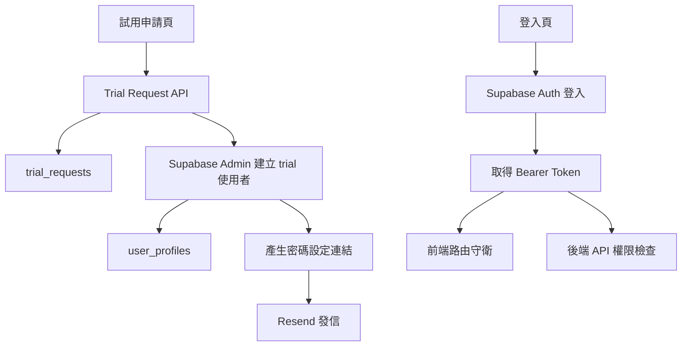

# 正式登入與試用申請 SQL / API 細化規格

## 1. 文件目的

本文件用於細化正式登入系統、`trial` 試用申請流程、`guest` 手動建立流程的 SQL 與 API 規格，作為後續實作依據。

本規格建立在目前系統現況之上：

- 現行登入 API 為硬編碼帳號模式，位置在 `api/login.js`
- 現行前端登入畫面位於 `public/index.html`
- 現行前端登入串接與 session 寫入位於 `public/js/main.js`
- 現行 API 權限檢查共用邏輯位於 `api/_auth.js`

---

## 2. 已確認決策

### 2.1 認證方案

- 採用 Supabase Auth 作為正式帳號系統
- 不再以硬編碼帳號作為正式登入來源
- 前端登入改為 email + password
- 自訂 API 以 Supabase Bearer Access Token 驗證使用者身份
- `x-api-token` 保留給 `service_backend` 類型的內部服務或 migration 工具

### 2.2 郵件方案

- 採用 Resend 發送帳號啟用與重送信件
- 試用帳號由後端自動建立後發送密碼設定信
- `guest` 帳號不提供公開申請，只能由管理員手動建立並發送啟用信

### 2.3 角色策略

| role | 說明 | 建立方式 |
| --- | --- | --- |
| `admin` | 系統管理者 | 既有管理員或手動建立 |
| `user` | 內部操作人員 | 手動建立 |
| `trial` | 試用帳號，14 天有效 | 公開申請後自動建立 |
| `guest` | 唯讀帳號 | 管理員手動建立 |
| `service_backend` | 伺服器內部身份 | 不進 Supabase Auth，以 service token 驗證 |

### 2.4 權限矩陣

| 功能 / 頁面 | guest | trial | user | admin |
| --- | --- | --- | --- | --- |
| Home | 可進入 | 可進入 | 可進入 | 可進入 |
| Dashboard | 可查看 | 可查看 | 可查看 | 可查看 |
| Product | 可查看 | 可查看 | 可查看 | 可查看 |
| Fitting Demo 頁面 | 不可進入 | 可進入 | 可進入 | 可進入 |
| Fitting Demo 拖拉 / 動作 | 不可 | 可 | 可 | 可 |
| CSV Import | 不可 | 不可 | 可 | 可 |
| Setting | 不可 | 不可 | 不可 | 可 |
| 建立 guest 帳號 | 不可 | 不可 | 不可 | 可 |
| 試用申請公開表單 | 不適用 | 不適用 | 不適用 | 不適用 |

補充：

- `trial` 必須受 14 天期限控管
- `guest` 僅可查看 `dashboard` 與 `product`，不得寫入任何事件或資料
- 所有頁面可見性需由前端與後端雙重限制

---

## 3. 目標架構



---

## 4. SQL 規格

## 4.1 依賴與前提

### 必要 extension

```sql
create extension if not exists citext;
create extension if not exists pgcrypto;
```

### 命名原則

- 公開業務表放在 `public`
- Supabase 內建帳號表使用 `auth.users`
- 所有帳號業務資料以 `auth.users.id` 為主鍵或外鍵依據

---

## 4.2 資料表一覽

| table | 用途 |
| --- | --- |
| `public.user_profiles` | 帳號角色、姓名、公司、職位、trial 期限與狀態 |
| `public.trial_requests` | 公開試用申請、建立帳號結果、寄信狀態與錯誤追蹤 |
| `public.auth_audit_logs` | 建立帳號、重送郵件、角色變更、停用等審計紀錄 |

---

## 4.3 `public.user_profiles`

### 用途

- 補足 `auth.users` 不適合承載的業務欄位
- 提供前端與 API 的角色、狀態、trial 到期判斷來源
- 作為 RLS 檢查依據

### 建議欄位

| 欄位 | 型別 | 必填 | 說明 |
| --- | --- | --- | --- |
| `user_id` | `uuid` | 是 | PK，對應 `auth.users.id` |
| `email` | `citext` | 是 | 使用者 email，需唯一 |
| `full_name` | `text` | 是 | 姓名 |
| `company_name` | `text` | 否 | 公司名稱 |
| `job_title` | `text` | 否 | 職位 |
| `role` | `text` | 是 | `admin` / `user` / `trial` / `guest` |
| `status` | `text` | 是 | `pending_activation` / `active` / `expired` / `disabled` |
| `trial_requested_at` | `timestamptz` | 否 | trial 申請時間 |
| `trial_expires_at` | `timestamptz` | 否 | trial 到期時間，僅 `trial` 需要 |
| `invited_by` | `uuid` | 否 | 建立此帳號的 admin |
| `last_login_at` | `timestamptz` | 否 | 最後成功登入時間 |
| `created_at` | `timestamptz` | 是 | 建立時間 |
| `updated_at` | `timestamptz` | 是 | 更新時間 |

### 約束

```sql
create table if not exists public.user_profiles (
  user_id uuid primary key references auth.users(id) on delete cascade,
  email citext not null unique,
  full_name text not null,
  company_name text,
  job_title text,
  role text not null check (role in ('admin', 'user', 'trial', 'guest')),
  status text not null default 'pending_activation'
    check (status in ('pending_activation', 'active', 'expired', 'disabled')),
  trial_requested_at timestamptz,
  trial_expires_at timestamptz,
  invited_by uuid references auth.users(id) on delete set null,
  last_login_at timestamptz,
  created_at timestamptz not null default now(),
  updated_at timestamptz not null default now(),
  constraint chk_user_profiles_trial_expiry
    check (
      (role = 'trial' and trial_expires_at is not null)
      or (role <> 'trial')
    )
);
```

### Index 建議

```sql
create index if not exists user_profiles_role_idx
  on public.user_profiles(role);

create index if not exists user_profiles_status_idx
  on public.user_profiles(status);

create index if not exists user_profiles_trial_expires_at_idx
  on public.user_profiles(trial_expires_at)
  where role = 'trial';
```

---

## 4.4 `public.trial_requests`

### 用途

- 記錄公開試用申請
- 保存自動建號、寄信成功或失敗狀態
- 防止重複申請與便於客服追查

### 建議欄位

| 欄位 | 型別 | 必填 | 說明 |
| --- | --- | --- | --- |
| `id` | `uuid` | 是 | PK |
| `full_name` | `text` | 是 | 申請人姓名 |
| `company_name` | `text` | 是 | 公司 |
| `job_title` | `text` | 是 | 職位 |
| `email` | `citext` | 是 | 申請 email |
| `request_status` | `text` | 是 | `pending` / `account_created` / `email_sent` / `email_failed` / `duplicate` / `rejected` |
| `requested_role` | `text` | 是 | 固定 `trial` |
| `supabase_user_id` | `uuid` | 否 | 建立出的 Supabase user id |
| `trial_expires_at` | `timestamptz` | 否 | 帳號到期時間 |
| `resend_provider` | `text` | 否 | 預設 `resend` |
| `resend_message_id` | `text` | 否 | 郵件供應商 message id |
| `error_code` | `text` | 否 | 建號或寄信錯誤碼 |
| `error_message` | `text` | 否 | 錯誤內容 |
| `request_ip` | `inet` | 否 | 來源 IP |
| `user_agent` | `text` | 否 | 瀏覽器資訊 |
| `created_at` | `timestamptz` | 是 | 建立時間 |
| `updated_at` | `timestamptz` | 是 | 更新時間 |

### 約束

```sql
create table if not exists public.trial_requests (
  id uuid primary key default gen_random_uuid(),
  full_name text not null,
  company_name text not null,
  job_title text not null,
  email citext not null,
  request_status text not null default 'pending'
    check (request_status in (
      'pending',
      'account_created',
      'email_sent',
      'email_failed',
      'duplicate',
      'rejected'
    )),
  requested_role text not null default 'trial'
    check (requested_role = 'trial'),
  supabase_user_id uuid references auth.users(id) on delete set null,
  trial_expires_at timestamptz,
  resend_provider text default 'resend',
  resend_message_id text,
  error_code text,
  error_message text,
  request_ip inet,
  user_agent text,
  created_at timestamptz not null default now(),
  updated_at timestamptz not null default now()
);
```

### 重複申請保護

```sql
create unique index if not exists trial_requests_open_email_uidx
  on public.trial_requests (lower(email::text))
  where request_status in ('pending', 'account_created', 'email_sent', 'email_failed');
```

### 狀態流轉

| from | to | 觸發條件 |
| --- | --- | --- |
| `pending` | `account_created` | Supabase Auth 使用者建立成功 |
| `account_created` | `email_sent` | Resend 發信成功 |
| `account_created` | `email_failed` | Resend 發信失敗 |
| `pending` | `duplicate` | 發現相同 email 仍有未結案紀錄 |
| `pending` | `rejected` | 未通過基本規則或人工拒絕 |
| `email_failed` | `email_sent` | 管理端重送成功 |

---

## 4.5 `public.auth_audit_logs`

### 用途

- 追蹤帳號建立、重送邀請、角色調整、停用、到期處理

### 建議欄位

```sql
create table if not exists public.auth_audit_logs (
  id bigint generated by default as identity primary key,
  actor_user_id uuid references auth.users(id) on delete set null,
  target_user_id uuid references auth.users(id) on delete set null,
  action text not null,
  entity_type text not null,
  entity_id text,
  result text not null check (result in ('success', 'failure')),
  metadata jsonb not null default '{}'::jsonb,
  created_at timestamptz not null default now()
);
```

### action 建議枚舉

- `trial_request_created`
- `trial_user_created`
- `trial_email_sent`
- `trial_email_resent`
- `guest_user_created`
- `user_role_changed`
- `user_disabled`
- `trial_expired`

---

## 4.6 Trigger 與輔助 function

### `public.set_updated_at`

- 若既有專案已存在，可直接重用
- 統一更新 `updated_at`

### `public.handle_new_auth_user_profile`

用途：

- 當 `auth.users` 新增使用者時，自動在 `public.user_profiles` 建立基本資料列
- 減少 `auth.users` 與 `public.user_profiles` 不一致風險

建議邏輯：

```sql
create or replace function public.handle_new_auth_user_profile()
returns trigger
language plpgsql
security definer
as $$
begin
  insert into public.user_profiles (
    user_id,
    email,
    full_name,
    company_name,
    job_title,
    role,
    status,
    trial_requested_at,
    trial_expires_at
  )
  values (
    new.id,
    new.email,
    coalesce(new.raw_user_meta_data->>'full_name', split_part(new.email, '@', 1)),
    new.raw_user_meta_data->>'company_name',
    new.raw_user_meta_data->>'job_title',
    coalesce(new.raw_app_meta_data->>'role', 'guest'),
    coalesce(new.raw_app_meta_data->>'status', 'pending_activation'),
    nullif(new.raw_app_meta_data->>'trial_requested_at', '')::timestamptz,
    nullif(new.raw_app_meta_data->>'trial_expires_at', '')::timestamptz
  )
  on conflict (user_id) do update
  set
    email = excluded.email,
    full_name = excluded.full_name,
    company_name = excluded.company_name,
    job_title = excluded.job_title,
    role = excluded.role,
    status = excluded.status,
    trial_requested_at = excluded.trial_requested_at,
    trial_expires_at = excluded.trial_expires_at,
    updated_at = now();

  return new;
end;
$$;
```

### `public.current_user_is_active`

用途：

- 供 RLS 檢查當前登入者是否為有效帳號
- 同時判斷 `trial` 是否過期

建議邏輯：

```sql
create or replace function public.current_user_is_active()
returns boolean
language sql
stable
as $$
  select exists (
    select 1
    from public.user_profiles up
    where up.user_id = auth.uid()
      and up.status = 'active'
      and (
        up.role <> 'trial'
        or up.trial_expires_at > now()
      )
  );
$$;
```

---

## 4.7 RLS 規格

## `public.user_profiles`

### 原則

- 使用者只能讀自己的 profile
- `admin` 可讀全部 profile
- `guest` / `trial` 不允許直接更新角色欄位
- 所有建立與修改以後端 service role API 執行為主

### policy 建議

```sql
alter table public.user_profiles enable row level security;

create policy user_profiles_select_self
on public.user_profiles
for select
using (user_id = auth.uid());

create policy user_profiles_select_admin
on public.user_profiles
for select
using (
  exists (
    select 1
    from public.user_profiles up
    where up.user_id = auth.uid()
      and up.role = 'admin'
      and up.status = 'active'
  )
);
```

## `public.trial_requests`

### 原則

- 前端 client 不直接查寫資料表
- 只允許後端 service role API 存取
- 若未來需要 admin 後台查詢，再新增專用 API，不直接開放 client SQL

## 既有業務表的 select policy

下列既有資料表需允許有效帳號唯讀查詢：

- `public.products`
- `public.inventory_items`
- `public.rfid_events`
- `public.fitting_room_presence`
- `public.fitting_room_sessions`

建議共同條件：

```sql
public.current_user_is_active() = true
```

### 角色補充

- `guest`：只允許 `select`
- `trial`：只允許 `select`
- `user`：只允許 `select`
- `admin`：可依實際需要保留 `select`

注意：

- `fitting-demo` 的拖拉寫入不走前端直寫資料庫，而是走後端 API，因此資料表不需開 client `insert` 或 `update`

---

## 4.8 Migration 順序

1. 建立 `citext` 與 `pgcrypto`
2. 建立 `public.user_profiles`
3. 建立 `public.trial_requests`
4. 建立 `public.auth_audit_logs`
5. 建立 `public.handle_new_auth_user_profile`
6. 對 `auth.users` 掛 trigger
7. 啟用 `user_profiles` 與既有唯讀表的 RLS policy
8. 補齊 admin 首批帳號 profile
9. 執行 smoke query

### Smoke Query 建議

```sql
select table_name
from information_schema.tables
where table_schema = 'public'
  and table_name in ('user_profiles', 'trial_requests', 'auth_audit_logs')
order by table_name;

select column_name
from information_schema.columns
where table_schema = 'public'
  and table_name = 'user_profiles'
order by ordinal_position;

select proname
from pg_proc p
join pg_namespace n on n.oid = p.pronamespace
where n.nspname = 'public'
  and proname in ('handle_new_auth_user_profile', 'current_user_is_active');
```

---

## 5. API 規格

## 5.1 認證模式

### 前端登入

- 使用 Supabase JS Client `signInWithPassword`
- 不再沿用現有硬編碼 `/api/login` 作為正式登入入口
- 可保留 `/api/login` 作為短期 fallback 或直接退役，實作時擇一

### 自訂 API 驗證

優先順序：

1. `Authorization: Bearer <supabase_access_token>`
2. 若無 Bearer token，再判斷 `x-api-token` 是否為內部 `service_backend`

### Bearer Token 驗證結果

後端統一抽象為：

```json
{
  "ok": true,
  "auth_mode": "bearer",
  "user": {
    "id": "uuid",
    "email": "name@example.com",
    "role": "trial",
    "status": "active",
    "trial_expires_at": "2026-05-01T00:00:00.000Z"
  }
}
```

### 統一錯誤格式

```json
{
  "error": {
    "code": "FORBIDDEN",
    "message": "You do not have permission to perform this action"
  }
}
```

---

## 5.2 `GET /api/auth/me`

### 功能

- 回傳前端目前登入者的 profile、角色、有效狀態與 permissions map
- 作為前端路由守衛與按鈕顯示依據

### Auth

- 必須帶 Bearer token

### Response 200

```json
{
  "user": {
    "id": "8f8c...",
    "email": "demo@example.com"
  },
  "profile": {
    "role": "trial",
    "status": "active",
    "full_name": "王小明",
    "company_name": "Demo Co",
    "job_title": "Manager",
    "trial_expires_at": "2026-05-01T00:00:00.000Z"
  },
  "permissions": {
    "canViewDashboard": true,
    "canViewProduct": true,
    "canViewFittingDemo": true,
    "canUseFittingDemo": true,
    "canUseCsvImport": false,
    "canUseSetting": false,
    "canManageAccounts": false
  }
}
```

### Response 401

```json
{
  "error": {
    "code": "UNAUTHORIZED",
    "message": "Missing or invalid access token"
  }
}
```

### Response 403

```json
{
  "error": {
    "code": "ACCOUNT_EXPIRED",
    "message": "Trial account has expired"
  }
}
```

---

## 5.3 `POST /api/trial-requests`

### 功能

- 公開申請 trial 帳號
- 自動建立 Supabase Auth 使用者
- 寫入 `trial_requests`
- 設定 `trial_expires_at = now() + interval '14 days'`
- 產生密碼設定連結並透過 Resend 寄信

### Auth

- 不需登入

### Request Body

```json
{
  "full_name": "王小明",
  "company_name": "Demo Co",
  "job_title": "Store Manager",
  "email": "trial@example.com",
  "locale": "zh-Hant"
}
```

### 驗證規則

- `full_name` 必填，長度 1 到 80
- `company_name` 必填，長度 1 到 120
- `job_title` 必填，長度 1 到 120
- `email` 必填，需為合法 email
- 同一 email 若仍有 open request，回 `409 DUPLICATE_REQUEST`
- 同一 email 若已存在有效 `trial` 或 `guest` / `user` / `admin` 帳號，回 `409 EMAIL_ALREADY_REGISTERED`
- API 應加入 rate limit 與 bot 防護

### 內部流程

1. 驗證 body
2. 寫入 `trial_requests status=pending`
3. 使用 Supabase Admin API 建立使用者
4. 設定 app metadata
   - `role=trial`
   - `status=active`
   - `trial_requested_at`
   - `trial_expires_at`
5. 寫入或更新 `user_profiles`
6. 產生密碼設定連結
7. 透過 Resend 寄送 welcome email
8. 更新 `trial_requests` 狀態與 message id
9. 寫入 `auth_audit_logs`

### Response 201

```json
{
  "ok": true,
  "request_id": "c3d4...",
  "status": "email_sent",
  "message": "Trial account created. Please check your email to set password."
}
```

### Response 409 duplicate

```json
{
  "error": {
    "code": "DUPLICATE_REQUEST",
    "message": "A pending trial request already exists for this email"
  }
}
```

### Response 500

```json
{
  "error": {
    "code": "TRIAL_PROVISION_FAILED",
    "message": "Failed to provision trial account"
  }
}
```

---

## 5.4 `POST /api/admin/guest-users`

### 功能

- 由 `admin` 手動建立 `guest` 帳號
- 寄出帳號啟用 / 設定密碼信

### Auth

- Bearer token
- 僅 `admin` 可呼叫

### Request Body

```json
{
  "full_name": "李來賓",
  "company_name": "Visitor Org",
  "job_title": "Consultant",
  "email": "guest@example.com",
  "locale": "zh-Hant"
}
```

### 驗證規則

- email 不可與既有帳號重複
- role 固定為 `guest`
- `trial_expires_at` 必須為 `null`

### Response 201

```json
{
  "ok": true,
  "user_id": "2a9b...",
  "role": "guest",
  "status": "email_sent"
}
```

### Response 403

```json
{
  "error": {
    "code": "FORBIDDEN",
    "message": "Admin role is required"
  }
}
```

---

## 5.5 `POST /api/admin/users/:userId/resend-invite`

### 功能

- 針對 `trial` 或 `guest` 重新產生密碼設定連結並重送郵件

### Auth

- Bearer token
- 僅 `admin` 可呼叫

### Path Params

- `userId`：Supabase user id

### Request Body

```json
{
  "reason": "email_not_received",
  "locale": "zh-Hant"
}
```

### Response 200

```json
{
  "ok": true,
  "user_id": "2a9b...",
  "resent": true
}
```

---

## 5.6 既有 API 調整規格

## `POST /api/rfid-webhook`

### 新權限規則

| role | 結果 |
| --- | --- |
| guest | 拒絕 |
| trial | 允許 |
| user | 允許 |
| admin | 允許 |
| service_backend | 允許 |

### 新認證方式

- 優先 Bearer token
- 僅在內部腳本或 seed 場景下接受 `x-api-token`

## `POST /api/bulk-products`

### 新權限規則

| role | 結果 |
| --- | --- |
| guest | 拒絕 |
| trial | 拒絕 |
| user | 允許 |
| admin | 允許 |
| service_backend | 允許 |

## 其他保護

- `guest` 與 `trial` 不得存取 setting 類管理 API
- 任何寫入 API 都不得再信任前端傳來的 `x-user-role`
- 角色以 Bearer token + `user_profiles` 查得結果為準

---

## 6. API 權限檢查 helper 規格

現行 `api/_auth.js` 需改造為以下邏輯：

1. 讀取 `Authorization` Bearer token
2. 以 Supabase 驗證 token 並取得 `auth.users` 身份
3. 讀 `public.user_profiles`
4. 驗證 `status='active'`
5. 若 `role='trial'`，額外驗證 `trial_expires_at > now()`
6. 依 API 所需角色判斷允許或拒絕
7. 若無 Bearer token，再嘗試 `x-api-token` 僅供 `service_backend`

### Helper 輸出建議

```json
{
  "ok": true,
  "auth_mode": "bearer",
  "role": "guest",
  "user_id": "uuid",
  "email": "guest@example.com",
  "status": "active",
  "trial_expires_at": null
}
```

---

## 7. 環境變數規格

| key | 用途 |
| --- | --- |
| `SUPABASE_URL` | Supabase 專案 URL |
| `SUPABASE_ANON_KEY` | 前端登入與 client query |
| `SUPABASE_SERVICE_ROLE_KEY` | 後端管理 API 與建號用 |
| `RESEND_API_KEY` | 發送邀請信 |
| `RESEND_FROM_EMAIL` | 寄件人 |
| `APP_BASE_URL` | 郵件內 redirect URL |
| `TRIAL_ACCOUNT_DAYS` | 預設 `14` |
| `API_AUTH_ENABLED` | 保留，但新架構下主要用於內部 token fallback 控制 |
| `API_SHARED_TOKEN` | `service_backend` 用 |

---

## 8. 驗收清單

### SQL 層

- 可成功建立 `user_profiles`、`trial_requests`、`auth_audit_logs`
- `trial` 使用者 profile 必須有 `trial_expires_at`
- `guest` 使用者 profile 不可有 `trial_expires_at`
- RLS 下有效登入者可讀產品與看板資料
- 過期 `trial` 無法通過 `current_user_is_active()`

### API 層

- 公開 trial 申請成功後，`trial_requests` 狀態最終為 `email_sent`
- trial 使用者能收到設定密碼信並登入
- admin 可建立 guest 並重送邀請
- guest 呼叫 `rfid-webhook` 必須回 403
- trial 呼叫 `rfid-webhook` 成功
- trial 與 guest 呼叫 `bulk-products` 必須回 403

### 前端層

- guest 僅可進 `dashboard` 與 `product`
- trial 可進 `fitting-demo` 且可拖拉
- trial / guest 都不能進 `csv-import` 與 `setting`
- 到期 `trial` 重新整理後應被導向到期提示或登入頁

---

## 9. 實作順序建議

1. 先做 SQL migration 與 RLS
2. 實作新的 `api/_auth.js` Bearer 驗證 helper
3. 實作 `GET /api/auth/me`
4. 實作 `POST /api/trial-requests`
5. 實作 `POST /api/admin/guest-users`
6. 實作 `POST /api/admin/users/:userId/resend-invite`
7. 接前端登入、申請頁、路由守衛、按鈕權限
8. 調整既有 `rfid-webhook` / `bulk-products` 權限
9. 做 end-to-end smoke test

---

## 10. 不在本次首批範圍

- 公開 guest 申請
- 多組織 tenant 隔離
- 管理員後台完整帳號列表 UI
- MFA
- SSO

