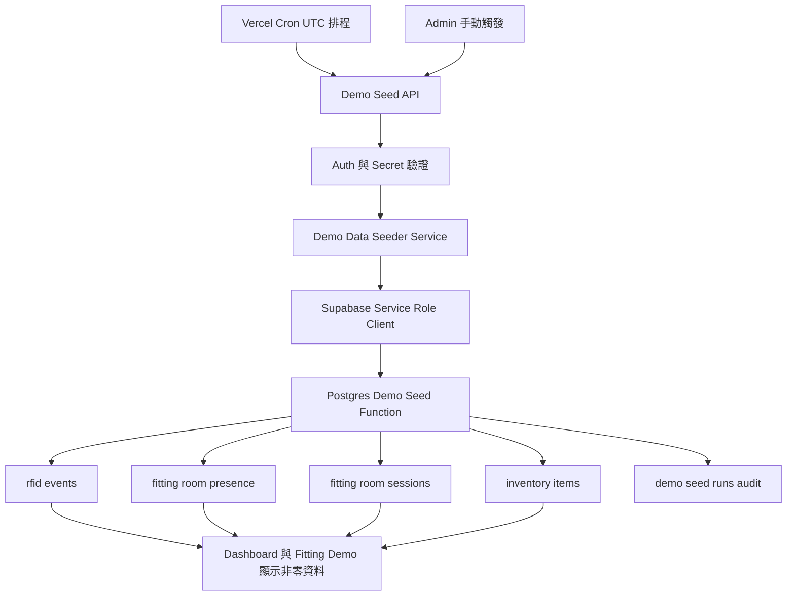

# 每日 Demo 測試數據生成架構建議

## 1. 背景與目標

目前專案已經具備可展示 Dashboard、Fitting Demo、RFID event flow 的基礎，但如果當天沒有操作資料，Dashboard 與 Demo 畫面容易出現全 0。既有資料與程式碼顯示：

- 專案部署設定目前集中在 [`vercel.json`](../vercel.json:1)，尚未設定排程。
- 伺服端已有 Supabase service-role client，可由後端安全寫入資料，入口是 [`getSupabaseAdminClient()`](../server/supabase.js:13)。
- 現有 webhook 已定義事件寫入、presence、session、庫存狀態同步流程，入口是 [`handler()`](../api/rfid-webhook.js:413)。
- Dashboard 主要讀取 products、rfid_events、fitting_room_presence、fitting_room_sessions、inventory_items，核心彙整邏輯在 [`buildDashboardData()`](../server/services/dashboard-metrics.js:500)。
- 既有 SQL seed 腳本已經證明需要的資料形狀，包含在場、逾時、checkout、sale、近期事件，來源是 [`plans/sql_seed_rich_demo_data.sql`](sql_seed_rich_demo_data.sql:1)。

建議目標：每天本地日期更新後，自動生成當日 demo activity，並保留管理員可手動觸發的入口。

## 2. 推薦架構

推薦採用「Vercel Cron 觸發 API，API 呼叫資料庫 seed service」的混合式架構。

### 為什麼推薦這個方案

1. 排程與手動入口都走同一條 API，避免兩套生成邏輯。
2. 真正資料寫入集中在資料庫函式內，方便用交易保證一致性。
3. API 層只負責權限、排程驗證、參數、回傳結果與 logging。
4. 可沿用現有 seed 腳本的邏輯，不需要重新發明資料場景。
5. 可透過 seed tag 與 seed date 做冪等，避免每天重複塞爆資料。

## 3. 元件設計

### 3.1 Vercel 排程

在 [`vercel.json`](../vercel.json:1) 新增 crons 設定，排程建議跑在 Asia Shanghai 日期切換後的 00:10。Vercel Cron 使用 UTC，因此對應 schedule 為 16:10 UTC。

建議 cron 目標：[`api/demo-data/daily-seed.js`](../api/demo-data/daily-seed.js)

建議 schedule：10 16 * * *

### 3.2 API 入口

新增 [`api/demo-data/daily-seed.js`](../api/demo-data/daily-seed.js)，支援兩種觸發：

- 排程觸發：由 Vercel Cron 呼叫，驗證 CRON_SECRET。
- 管理員觸發：由前端管理員按鈕呼叫，驗證 [`authorizeAdmin()`](../server/auth.js:307)。

API 回傳應包含：

- target_date
- seed_tag
- inserted_events_count
- upserted_presence_count
- inserted_sessions_count
- updated_inventory_count
- skipped_reason
- run_id

### 3.3 Seeder service

新增 [`server/services/demo-data-seeder.js`](../server/services/demo-data-seeder.js)，統一處理：

- 解析 target date 與 local timezone。
- 呼叫 Supabase RPC 或資料庫函式。
- 將錯誤轉成可讀 API response。
- 寫入後做基本 verification。

此 service 透過 [`getSupabaseAdminClient()`](../server/supabase.js:13) 使用 service role 執行，避免受 RLS 影響。

### 3.4 資料庫函式

把 [`plans/sql_seed_rich_demo_data.sql`](sql_seed_rich_demo_data.sql:1) 重構為可重複呼叫的資料庫函式，例如 public.seed_daily_demo_data。

函式輸入：

- p_target_date date
- p_seed_tag text
- p_force boolean
- p_timezone text

函式輸出：

- run_id
- status
- affected counts
- error message

函式內部原則：

- 使用 transaction 保證事件、presence、session、inventory 狀態一致。
- 只清理由 daily seed 產生的資料，不清除人工 demo 或真實操作資料。
- rfid_events metadata 寫入 seed_tag、seed_date、scenario、generated_by。
- fitting_room_presence 只建立當前展示需要的在場快照。
- fitting_room_sessions 建立當日 open、closed、converted 三類 session。
- inventory_items 更新為 ACTIVE、FITTING_ROOM、CHECKOUT、SOLD 的展示分布。

### 3.5 Audit table

建議新增 public.demo_seed_runs，記錄每次生成行為。

建議欄位：

- id
- seed_date
- seed_tag
- trigger_source
- status
- started_at
- finished_at
- counts jsonb
- error_message
- created_by

用途：

- 避免重複生成。
- 管理員可看到最近一次是否成功。
- 排查為什麼 demo 畫面又出現 0。

## 4. 資料生成策略

每日 seed 要產生少量、可講故事的 demo 分布，不是大量亂數塞事件。最新需求補充：每天自動產生 3 到 7 筆亂數 demo activity，狀態需要分散在試衣間、checkout、已結帳、離場未買等情境，避免畫面全 0，同時保持 demo 看起來合理。

建議每日產生規則：

1. 每日總筆數：隨機 3 到 7 筆，以 seed_date 做 deterministic random seed，確保同一天重跑結果一致。
2. 必須至少包含 1 筆試衣間在場情境，狀態為 FITTING_ROOM，對應 enter_fitting_room event 與 fitting_room_presence。
3. 若總筆數 >= 4，至少包含 1 筆 checkout 或已結帳情境，狀態為 CHECKOUT 或 SOLD，對應 move_to_checkout 或 sale_completed event。
4. 可選擇性產生 1 筆 long dwell，讓 abnormal stay 或 operational alert 不為 0。
5. 可選擇性產生 1 到 2 筆離場未買，形成 drop off 與 missed revenue 故事。
6. 近 7 日 sale_completed 可以補少量資料，讓 replenishment risk 與 sales7d 不為 0，但不列入今日 3 到 7 筆主 activity 上限。
7. 庫存狀態：只更新被選中的 inventory_items，其餘商品維持原狀或 ACTIVE，避免 daily seed 過度干擾商品庫存。

建議狀態權重：

- FITTING_ROOM：40%
- CHECKOUT：20%
- SOLD：20%
- RETURNED_TO_FLOOR 或 ACTIVE：20%

若亂數抽樣後不符合必備條件，seeder 需做後處理修正，例如把第一筆改為 FITTING_ROOM，並在筆數足夠時把第二筆改為 CHECKOUT 或 SOLD。

選品策略：

- 從 products 與 inventory_items 選出已有 product_id 與 epc_data 的商品。
- 至少需要 6 筆可用 inventory item；不足時不強行生成，改回傳 schema or data readiness error。
- 使用 product id 或 item order 加上日期做 deterministic pattern，讓每天略有變化但可重複驗證。

## 5. 冪等與清理策略

每日資料生成必須可安全重跑。

建議規則：

1. 同一 seed_date、seed_tag 預設只執行一次。
2. 管理員手動 force 時，先刪除同 seed_date 與 seed_tag 的 generated rows，再重建。
3. 刪除 rfid_events 時只刪 metadata.seed_tag 與 metadata.seed_date 相符的資料。
4. 若舊 schema 沒有 metadata，退而只清 event_source 為 system 且 timestamp 落在當日的生成資料。
5. 不清除 event_source 為 demo_drag、rfid_reader 的資料，避免覆蓋現場操作。

## 6. 權限與安全

需要環境變數：

- SUPABASE_URL
- SUPABASE_SERVICE_ROLE_KEY
- CRON_SECRET
- API_SHARED_TOKEN 保留給既有 service token flow

API 驗證建議：

- 排程 GET：驗證 Authorization Bearer CRON_SECRET。
- 手動 POST：驗證 [`authorizeAdmin()`](../server/auth.js:307)。
- 禁止 demo_viewer 寫入，延續目前唯讀設計。
- 所有寫入只在 server side 使用 service role，前端不接觸 service role key。

## 7. 前端手動入口

目前前端已有 Seed Today Data 按鈕與 handler，位置可參考 [`handleSeedTodayData()`](../public/js/main.js:1803) 與事件綁定 [`initApp()`](../public/js/main.js:6075)。

建議調整：

- 若使用者是 admin，按鈕呼叫每日 seed API。
- 若非 admin 但有 demo 操作權限，可維持現有 scenario 觸發。
- 成功後刷新 Dashboard。
- toast 顯示 run_id 與生成摘要。

## 8. 驗收標準

1. Vercel Cron 可在每日 00:10 Asia Shanghai 後觸發 API。
2. API 可被 admin 手動 POST 觸發。
3. 同一天重跑不會無限增加重複事件。
4. Dashboard 今日區間不再全 0。
5. Fitting Demo 可看到 fitting、checkout、recent events。
6. demo_seed_runs 可查到成功或失敗紀錄。
7. schema 不足或 inventory 不足時，API 回傳明確錯誤，不插入半套資料。

## 9. 實作 todo

1. 新增資料庫 migration，建立 public.demo_seed_runs 與 public.seed_daily_demo_data。
2. 將 [`plans/sql_seed_rich_demo_data.sql`](sql_seed_rich_demo_data.sql:1) 轉為可接收 target_date、seed_tag、force 的函式。
3. 新增 [`server/services/demo-data-seeder.js`](../server/services/demo-data-seeder.js)。
4. 新增 [`api/demo-data/daily-seed.js`](../api/demo-data/daily-seed.js)。
5. 在 [`vercel.json`](../vercel.json:1) 加入 crons。
6. 調整 [`handleSeedTodayData()`](../public/js/main.js:1803) 讓 admin 可呼叫 API。
7. 補一份 smoke SQL 或 API 驗證腳本，確認 events、presence、sessions、inventory 分布。
