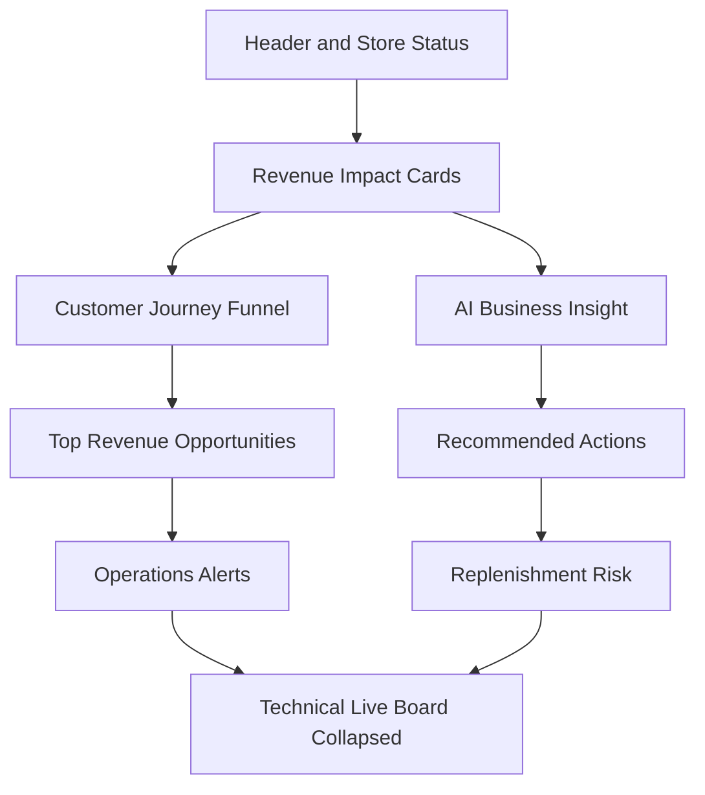

# Dashboard 3.1 前端改版施工單

## Implementation Plan

### 背景與決策

- 需求來源：[`dashboard plan 3.1.md`](../規格書%203.0/dashboard%20plan%203.1.md:1)
- 目標：把現有 Dashboard 從 RFID 技術監控頁，改成店鋪營收與轉換率決策中心。
- Vercel 限制決策：本階段不新增任何 dashboard API function，避免消耗 12 個 Serverless Functions 配額。
- 實作方式：沿用現有前端資料來源，在前端建立 dashboard summary view model 與商業指標呈現層。

---

## 1. Files to edit

### 1.1 必改檔案

1. [`public/index.html`](../public/index.html:57)
   - 調整 Dashboard 主畫面 HTML 結構。
   - 新增 Revenue、Journey、AI Insight、Recommended Actions、Top Opportunities、Operations Alerts、Replenishment Risk、Technical Board 收合容器。

2. [`public/js/main.js`](../public/js/main.js:84)
   - 補 DOM reference。
   - 新增前端 summary view model 計算。
   - 更新 Dashboard render 流程。
   - 保留既有 RFID board、drag-and-drop、complete sale、detail overlay 邏輯。

3. [`public/css/style.css`](../public/css/style.css:489)
   - 新增 B2B SaaS dashboard 視覺樣式。
   - 新增 revenue card、funnel、action card、risk badge、technical board collapsed 狀態與 responsive layout。

### 1.2 原則上不改檔案

1. [`vercel.json`](../vercel.json:1)
   - 本階段原則上不需要修改。
   - 只有 Dashboard route 有靜態路由問題時才檢查，不主動變更。

2. [`api/`](../api)
   - 本階段不新增、刪除、拆分或改造 API function。

---

## 2. Exact changes

### 2.1 Dashboard 資訊架構

將 Dashboard view 改成以下呈現順序：

### 2.2 [`public/index.html`](../public/index.html:57)

1. 將 Dashboard 標題從技術 demo 定位改為商業轉換定位。
   - 建議主標題：RFID Retail Conversion Dashboard。
   - 建議副標題：Turn fitting room activity into revenue growth。

2. 保留現有外層 shell、nav、auth、home、product、csv、setting 結構，只替換 Dashboard view 內部主要 layout。

3. 新增或替換主要容器：
   - Revenue Impact Cards：missed revenue、potential uplift、try-on to sale rate、top loss driver。
   - Customer Journey Funnel：rack interest、fitting room、checkout intent、completed sales。
   - AI Business Insight：headline、summary、business impact、possible reasons、confidence。
   - Recommended Actions：依 priority 顯示 staff follow-up、product review、restock、checkout flow review。
   - Top Revenue Opportunities：依 opportunity score 排序。
   - Operations Alerts：用 business risk 文案取代技術異常文案。
   - Replenishment Risk：低庫存與 safety stock 風險。
   - Detailed Live Board：改成 Technical Live Board，預設收合，展開後顯示原本 RFID board。

4. 技術 live board 的既有節點必須保留：
   - [`refreshButton`](../public/index.html:224) 行為需保留。
   - [`dashboard`](../public/index.html:249) board 容器需保留或移入 collapsible body。
   - 不能讓 [`bindBoardDnD`](../public/js/main.js:4233) 找不到 board 容器。

### 2.3 [`public/js/main.js`](../public/js/main.js:84)

1. 在 DOM cache 補新增節點 reference：
   - Revenue container。
   - Journey funnel container。
   - AI insight container。
   - Recommended actions container。
   - Top opportunities container。
   - Operations alerts container。
   - Replenishment risk container。
   - Technical board toggle button。
   - Technical board panel body。

2. 新增前端 view model builder，建議放在現有 analytics helper 附近：
   - [`computeStoryFunnelMetrics`](../public/js/main.js:3536)
   - [`computeOpportunityRows`](../public/js/main.js:3558)
   - 新增 `buildDashboardSummaryModel`
   - 新增 `computeRevenueImpact`
   - 新增 `computeJourneyFunnel`
   - 新增 `computeAIBusinessInsight`
   - 新增 `computeRecommendedActions`
   - 新增 `computeTopRevenueOpportunities`
   - 新增 `computeOperationAlerts`
   - 新增 `computeReplenishmentRisk`

3. Revenue 計算規則：
   - missedRevenueToday = try-on 有量但 sale 為 0 的品項，依 try-on count 乘 unit price 加總。
   - opportunityScore = tryOnCount × unitPrice × 1 minus conversionRate。
   - tryOnToSaleRate = completedSalesCount / fittingRoomCount。
   - 若分母為 0，一律回傳 0，不顯示 NaN 或 Infinity。
   - 若 price 缺失，使用 0 或合理 fallback，並避免破壞排序。

4. Journey 計算規則：
   - rackInterestCount：可先用目前 rack state count 或當日 tag_seen/rack 事件量 fallback。
   - fittingRoomCount：使用 todaySessions 或 enter_fitting_room 事件量。
   - checkoutIntentCount：使用 move_to_checkout 事件量。
   - completedSalesCount：使用 todaySaleEvents。
   - mainDropOffStage：比較各階段轉換差距後輸出 after_fitting_room、after_checkout 或 no_activity。

5. Recommended Actions 規則：
   - long dwell count > 0：產生 staff follow-up。
   - try-on count > 0 且 sales count = 0：產生 product review。
   - current stock < safety stock：產生 restock。
   - checkout intent > sales：產生 checkout flow review。
   - 每個 action 需包含 priority、type、title、reason、suggestedAction、expectedImpact、severity、relatedSkus。

6. Render 流程建議：
   - 在 [`renderDashboard`](../public/js/main.js:3931) 建好 grouped 後，先產生 summary model。
   - 用新的 `renderDashboardSummary` 或改造 [`renderManagerOverview`](../public/js/main.js:3642) 與 [`renderAnalyticsModules`](../public/js/main.js:3794) 來更新商業 dashboard 區塊。
   - 保持原本 [`renderDashboard`](../public/js/main.js:4074) 對 board columns 的產出邏輯，僅移到收合區展示。

7. i18n 文案更新：
   - Dashboard title 改為 RFID Retail Conversion Dashboard 或 Fitting Room Revenue Intelligence。
   - Abnormal Stay 改為 Customer Experience Risk。
   - Opportunity Items 改為 Revenue Opportunities。
   - AI Summary 改為 AI Business Insight。
   - Rack 改為 Product Interest。
   - Checkout 改為 Purchase Intent。
   - zh-Hant、zh-Hans、ja 至少補齊主要 dashboard 新文案；若來不及，英文 fallback 不能造成 undefined。

8. Technical board collapse 行為：
   - 預設 collapsed。
   - button copy：Show Technical Details / Hide Technical Details。
   - 展開後仍可 refresh、drag item、complete sale、點 item 看 detail。

### 2.4 [`public/css/style.css`](../public/css/style.css:489)

1. 新增 B2B SaaS dashboard 風格：
   - 淺灰背景。
   - 白色卡片。
   - Deep blue / indigo 作為 primary。
   - 綠色代表 revenue / opportunity。
   - Amber 代表 warning。
   - Red 代表 critical。

2. 新增 layout class：
   - dashboard revenue grid。
   - dashboard two-column insight grid。
   - action recommendation list。
   - opportunity list。
   - risk cards。
   - technical board collapsed body。

3. 保留既有樣式，不要大規模刪除：
   - [`manager-hero`](../public/css/style.css:747)
   - [`manager-kpi-grid`](../public/css/style.css:764)
   - [`dashboard-analytics-section`](../public/css/style.css:489)
   - [`state-column`](../public/css/style.css:902)
   - [`product-card`](../public/css/style.css:959)

4. Responsive 行為：
   - desktop：revenue cards 四欄，insight/action 區雙欄。
   - tablet：兩欄。
   - mobile：單欄。
   - Technical board 在小螢幕仍能水平或單欄閱讀。

---

## 3. Do not touch

1. 不新增任何 dashboard API function。
   - 不新增 dashboard summary endpoint。
   - 不新增 dashboard actions endpoint。
   - 不新增 dashboard opportunities endpoint。
   - 原因：Vercel 12 function 限制下，本階段不消耗新配額。

2. 不修改現有 Vercel function 架構：
   - 不新增 [`api/dashboard`](../api) 相關檔案。
   - 不拆動 [`api/admin/[...route].js`](../api/admin/%5B...route%5D.js:1)。
   - 不拆動 [`api/auth/[...route].js`](../api/auth/%5B...route%5D.js:1)。
   - 不處理 [`api/login.js`](../api/login.js:1) 是否退役。

3. 不修改資料庫 schema 或 SQL：
   - 不新增 table。
   - 不新增 migration。
   - 不修改 RLS policy。
   - 不改 Supabase schema。

4. 不破壞既有 RFID demo 行為：
   - 保留 [`syncDragAction`](../public/js/main.js:4191)。
   - 保留 [`bindBoardDnD`](../public/js/main.js:4233)。
   - 保留 complete sale 流程。
   - 保留 item detail overlay。
   - 保留 refresh dashboard 行為。
   - 保留現有 fitting demo page。

5. 不修改非 Dashboard 模組：
   - 不改 Product 頁面。
   - 不改 CSV Import 頁面。
   - 不改 Setting 頁面。
   - 不改 Trial Request / Login / Auth flow。

6. 不大幅重寫 [`public/js/main.js`](../public/js/main.js:1)：
   - 以新增小型 helper 與替換 Dashboard render 為主。
   - 避免把現有 5000 多行檔案重排，降低 merge 與回歸風險。

---

## 4. Test checklist

### 4.1 Function 數量與部署風險

- [ ] 確認沒有新增任何 [`api`](../api) 檔案。
- [ ] 確認沒有新增 dashboard API route。
- [ ] 確認 [`vercel.json`](../vercel.json:1) 未被不必要修改。

### 4.2 Dashboard route

- [ ] 開啟 Dashboard route 後可正常載入。
- [ ] Header 顯示 RFID Retail Conversion Dashboard。
- [ ] Store status 顯示 Live Store、RFID Tracking、AI Assistant。
- [ ] Empty state 不會出現 undefined、NaN、Infinity。

### 4.3 Revenue Impact Cards

- [ ] Missed Revenue Today 可顯示金額。
- [ ] Potential Sales Uplift 可顯示區間。
- [ ] Try-On to Sale Rate 可顯示百分比。
- [ ] Top Loss Driver 在沒有資料時有 fallback。

### 4.4 Customer Journey Funnel

- [ ] Product Interest、Fitting Room、Purchase Intent、Completed Sales 數字正確或合理 fallback。
- [ ] Funnel bar 寬度不會因 0 值破版。
- [ ] Main Drop-off Point 有合理文案。

### 4.5 AI Business Insight

- [ ] 有高興趣低轉換商品時，顯示對應 insight。
- [ ] 有 long dwell 時，顯示 staff assistance 風險。
- [ ] 無資料時，顯示 stable / monitoring 類 fallback。

### 4.6 Recommended Actions

- [ ] Long dwell 產生 staff follow-up。
- [ ] Try-on 有量但 0 sale 產生 product review。
- [ ] 低庫存產生 restock。
- [ ] Checkout intent 未完成成交產生 checkout flow review。
- [ ] Priority 排序穩定。

### 4.7 Top Revenue Opportunities

- [ ] 依 opportunityScore 排序。
- [ ] 顯示 try-ons、sales、conversion rate、estimated missed revenue、recommended action。
- [ ] 無資料時顯示 empty state。

### 4.8 Operations Alerts 與 Replenishment Risk

- [ ] Abnormal stay 不再以技術語言呈現，而是 Customer Experience Risk。
- [ ] Uncleared fitting-room items 轉成營運風險文案。
- [ ] Replenishment risk 顯示 currentStock、safetyStock、riskLevel、recommendedAction。

### 4.9 Technical Live Board

- [ ] 預設收合。
- [ ] 點 Show Technical Details 可展開。
- [ ] 展開後原本 Rack / Fitting Room / Checkout board 仍顯示。
- [ ] Refresh button 可用。
- [ ] Drag item 可用。
- [ ] Complete Sale button 可用。
- [ ] 點 product card 可開 detail overlay。

### 4.10 Language switching

- [ ] 英文文案完整。
- [ ] zh-Hant 主要 dashboard 文案完整。
- [ ] zh-Hans 與 ja 至少不出現 key name 或 undefined。
- [ ] 切換語言後 dashboard 能重新 render。

### 4.11 Responsive layout

- [ ] Desktop revenue card 四欄正常。
- [ ] Tablet 兩欄正常。
- [ ] Mobile 單欄正常。
- [ ] Technical board 在小螢幕不擠壓到無法操作。

---

## 5. 建議施工順序

1. 先改 [`public/index.html`](../public/index.html:57)，建立新 Dashboard 容器但保留原 technical board 節點。
2. 再改 [`public/js/main.js`](../public/js/main.js:84)，先補 DOM reference，再補 summary model，最後接上 render。
3. 再改 [`public/css/style.css`](../public/css/style.css:489)，讓新結構有完整視覺與 responsive 行為。
4. 最後跑 test checklist，特別確認沒有新增 Vercel function 與沒有破壞 RFID demo drag-and-drop。

---

## 6. 後續若需要後端 Dashboard API

若未來需要正式 API response shape，例如 summary、opportunities、actions，不建議新增獨立 `api/dashboard/*.js` function。建議先採下列其中一種策略：

1. 新增單一 catch-all app router，將 dashboard API 與其他未來業務 API 收斂到同一個 function。
2. 先退役或整併現有剩餘 function，釋出 Vercel 配額後再新增 dashboard API。
3. 只在前端資料量與安全性需求無法接受時才後端化 summary 計算。
