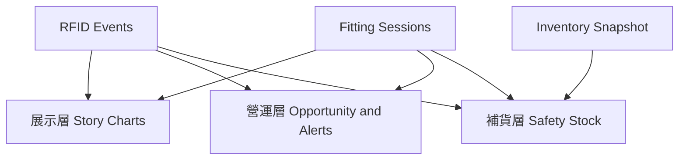
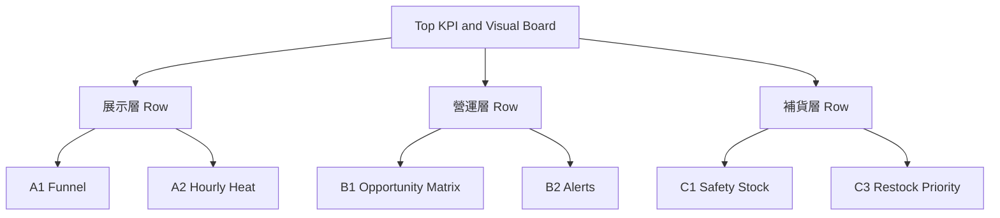

# Dashboard 下方分析區六模組三層方案

## 1. 現況判讀

- 目前 Dashboard 主畫面只包含 KPI 與圖像化看板，結構集中在 [`public/index.html`](public/index.html) 的 [`#dashboardView`](public/index.html:67) 區塊。
- 既有前端已經抓到可支撐分析區的主要資料來源，查詢入口在 [`fetchAndRenderDashboard()`](public/js/main.js:3269)
  - `products`
  - `rfid_events`
  - `fitting_room_presence`
  - `fitting_room_sessions`
  - `inventory_items`
- 既有 KPI 計算位於 [`computeKpiMetrics()`](public/js/main.js:2764)，既有補貨建議位於 [`computeRestockSuggestions()`](public/js/main.js:2781)。
- 規格書明確要求圖表少而精，不要一打開就是複雜圖海，依據 [`規格書 3.0/UI規格書 3.0.md`](規格書 3.0/UI規格書 3.0.md) 的 Executive Overview 描述，Dashboard 應該先講商業故事，再落到營運與補貨行動。

## 2. 規劃原則

1. **先故事、再診斷、最後行動**
   - 第一層先讓人看懂試衣到成交的轉換故事
   - 第二層告訴門市哪裡有問題
   - 第三層給出可執行的補貨與安全庫存決策
2. **避免圖表過量**
   - 建議新增 **4 到 6 個核心視覺模組**，不是每個指標都獨立做圖
3. **先用現有查詢能支撐的資料做 MVP，再補資料粒度**
4. **補貨圖表必須以 SKU 或款色尺碼層級聚合，不能只看單一 EPC**

## 3. 三段式資訊架構

### 建議版頁面順序

1. 保留現有 KPI + Visual Simulation Board
2. 在看板下方新增 **展示層**
3. 再往下新增 **營運層**
4. 頁面最下方新增 **補貨層**

這樣符合目前 [`public/index.html`](public/index.html) 的單頁垂直閱讀方式，也符合規格中先讓主管 3 秒理解價值、再展開分析的節奏。

---

## 4. 展示層規劃

### 模組 A1 試衣到成交漏斗圖

- **推薦圖型**：Horizontal Funnel 或 Step Bar
- **目的**：一眼說明 RFID 試衣流程如何帶出商業轉換
- **指標節點**
  - 今日試衣件數
  - 進入 Checkout 件數
  - 成交件數
  - 試衣後成交率
- **資料來源**
  - `fitting_room_sessions`
  - `rfid_events` 的 `sale_completed`
- **適合原因**
  - 目前既有 KPI 已有 `todayFitting`、`todaySales`、`conversionRate`，最容易往下延伸
  - 也是最適合 Demo 講故事的圖
- **顯示注意**
  - 漏斗分母要固定寫清楚是 `session` 還是 `item`
  - 建議優先用 `session` 當主口徑，避免多件試穿時重複計數

### 模組 A2 時段熱度圖

- **推薦圖型**：Compact Bar Chart 或 Hourly Heat Strip
- **目的**：回答什麼時間試衣最活躍、什麼時間成交掉下來
- **建議欄位**
  - 每小時試衣 session 數
  - 每小時成交數
- **資料來源**
  - `fitting_room_sessions.entered_at`
  - `rfid_events.timestamp` where `event_type = sale_completed`
- **適合原因**
  - 比長折線圖更輕量，符合規格要求的少而精
  - 能直接支援門市排班與導購時段策略
- **顯示注意**
  - 若當天資料少，改顯示近 7 日平均時段分布，避免空圖

### 展示層結論

- **展示層最推薦優先做 A1 + A2**
- 這一層最重要的是讓客戶感受到：`RFID 不是只在追蹤商品，而是在量化試衣到成交的過程`

---

## 5. 營運層規劃

### 模組 B1 商品機會矩陣

- **推薦圖型**：Quadrant Scatter
- **X 軸**：試穿次數
- **Y 軸**：試穿後成交率
- **點大小**：成交金額或潛在機會值
- **點顏色**：問題類型
  - 高試穿低成交
  - 尺碼缺口
  - 停留過久
- **目的**：快速找出高關注但轉換弱的商品
- **資料來源**
  - `products`
  - `rfid_events`
  - `fitting_room_sessions`
- **適合原因**
  - 符合 [`規格書 3.0/UI規格書 3.0.md`](規格書 3.0/UI規格書 3.0.md) 中 High Interest / Low Conversion Items 的概念
- **顯示注意**
  - 限制只顯示 Top 8 到 Top 12 商品，避免點位太多難讀
  - 若資料不足，退化成排名條圖

### 模組 B2 試衣間營運警示面板

- **推薦圖型**：Alert List + Mini KPI Chips
- **目的**：把即時風險集中呈現，而不是藏在 Event Log
- **建議內容**
  - 長停留商品數
  - 仍留在試衣間未清出件數
  - 今日異常 session 數
  - 指定房間連續高負載
- **資料來源**
  - `fitting_room_presence`
  - `fitting_room_sessions`
  - `rfid_events`
- **適合原因**
  - 目前前端已能判斷 abnormal stay，基礎邏輯已存在於 [`renderDashboard()`](public/js/main.js:2817)
- **顯示注意**
  - 這塊不一定要做成傳統圖表，做成高密度營運告警卡會比硬塞圖更有效

### 模組 B3 試穿組合與搭配建議

- **推薦圖型**：Top Pairings 條圖 或 Network List
- **目的**：回答哪些商品常一起被試穿，支援陳列搭配
- **資料來源**
  - 同一個 `fitting_room_session` 內的商品組合
- **前提**
  - 需確認 session 與商品關聯資料是否完整；若前端目前拿不到，這個模組列為第二階段
- **顯示注意**
  - 若無法穩定還原同 session 商品集合，先不要做，以免誤導

### 營運層結論

- **營運層最推薦優先做 B1 + B2**
- B3 很有商業價值，但要先確認 session 商品明細關聯夠完整

---

## 6. 補貨層規劃

### 模組 C1 安全庫存風險圖

- **推薦圖型**：Bullet Chart 或 Dual Bar
- **每列欄位**
  - 目前庫存
  - 安全庫存
  - 近 7 日銷量
  - 建議補貨量
- **目的**：讓補貨判斷不只是看到缺貨，而是看到離安全線還有多遠
- **資料來源**
  - `inventory_items`
  - `rfid_events` 的近 7 日銷售
  - `products` 的 `sku`、`style_no`、`size`
- **建議公式**
  - `avg_daily_sales = sold_7d / 7`
  - `safety_stock = ceil avg_daily_sales × 安全天數`
  - `reorder_point = safety_stock + 在途緩衝`
  - `suggested_restock = max 0 of reorder_point - current_stock`
- **顯示注意**
  - 安全庫存必須以 `SKU` 或 `style + size` 聚合
  - 目前 [`computeRestockSuggestions()`](public/js/main.js:2781) 用 `epc_data` 與 `product_id` 推估，適合 Demo 提示，不適合作為正式安全庫存依據

### 模組 C2 尺碼缺口熱圖

- **推薦圖型**：Size Heatmap
- **列**：款式或主商品
- **欄**：尺寸 XS S M L XL
- **色彩**：庫存覆蓋天數或缺口程度
- **目的**：快速看出不是整款缺貨，而是哪個尺碼失衡
- **資料來源**
  - `products.size`
  - `inventory_items`
  - 近 7 日銷量
- **適合原因**
  - RFID 試衣場景很適合講 size mismatch，而不是只講總庫存
- **顯示注意**
  - 若資料量小，可先只做 Top 5 款式

### 模組 C3 補貨優先清單

- **推薦圖型**：Ranked Table
- **欄位**
  - SKU
  - 近 7 日銷售
  - 目前可用庫存
  - 安全庫存
  - 缺口
  - 優先級
- **目的**：提供營運可直接執行的 action list
- **資料來源**
  - 同 C1
- **顯示注意**
  - 這張表比純圖表更適合落地，因此建議和 C1 搭配出現

### 補貨層結論

- **補貨層最推薦優先做 C1 + C3**
- C2 適合在尺碼資料穩定後加入，會讓整體方案更像零售決策系統，而不是一般數據看板

---

## 7. 本案採用的六模組組合

1. A1 試衣到成交漏斗
2. A2 時段熱度圖
3. B1 商品機會矩陣
4. B2 營運警示面板
5. C1 安全庫存風險圖
6. C3 補貨優先清單

這一版作為正式推薦基準，原因如下：

- **展示層** 有完整故事線，能把試衣與成交關係講清楚
- **營運層** 能快速指出商品問題與現場風險
- **補貨層** 能把分析收斂成安全庫存與補貨行動

若後續要縮成 MVP，可先保留 A1、B2、C1、C3 四模組，但本規劃書以下內容都以六模組完整版為主。

---

## 8. 實作建議

### 前端結構

- 在 [`public/index.html`](public/index.html) 的 [`#dashboardView`](public/index.html:67) 之下新增三個分析 section
  - `dashboard-story-section`
  - `dashboard-ops-section`
  - `dashboard-replenishment-section`

### 前端資料整理

- 在 [`fetchAndRenderDashboard()`](public/js/main.js:3269) 擴充查詢欄位
  - `fitting_room_sessions` 建議補抓 `entered_at`、`exited_at`、`fitting_room_id`、`session_status`
  - 若要算商品機會矩陣，需補商品層級的試穿聚合
- 在 [`renderDashboard()`](public/js/main.js:2817) 之外拆出新的分析資料計算函式
  - `computeFunnelMetrics`
  - `computeHourlyMetrics`
  - `computeOpportunityMatrix`
  - `computeSafetyStockMetrics`

### 圖表元件策略

- 目前 [`package.json`](package.json) 沒有圖表套件
- 推薦兩個方向
  1. **Chart.js CDN**
     - 實作快
     - 適合漏斗替代條圖、條形圖、熱度條圖
  2. **原生 HTML + CSS + SVG**
     - 依賴少
     - 更容易維持 enterprise dashboard 風格一致

### 顯示與語意準則

- 漏斗以 `session` 為主口徑
- 補貨以 `SKU` 或 `style + size` 為主口徑
- 空資料時顯示 guidance 文案，不顯示空白圖框
- 每張圖右上角都建議放時間範圍標籤，例如 `Today`、`Last 7 days`

---

## 9. 切到 Code mode 的執行清單

- 在 [`public/index.html`](public/index.html) 新增三層分析區容器
- 在 [`public/css/style.css`](public/css/style.css) 新增分析區版型與卡片樣式
- 在 [`public/js/main.js`](public/js/main.js:3269) 擴充查詢欄位與資料聚合
- 新增漏斗圖與安全庫存圖的 render 函式
- 重構既有 [`computeRestockSuggestions()`](public/js/main.js:2781)，改為安全庫存導向聚合
- 補上多語系文案 key
- 驗證資料不足時的 empty state 與 fallback

## 10. 結論

最推薦的方向不是單純在 Dashboard 下方塞更多圖，而是把下半部重新定義成：

- **展示層** 講清楚試衣到成交
- **營運層** 找出轉換與現場問題
- **補貨層** 把安全庫存與尺碼缺口變成可執行清單

這樣最符合目前規格中的零售決策導向，也最容易讓 Demo 從單純視覺化，升級成真正有商業說服力的 SaaS Dashboard。

---

## 11. 六模組總覽表

| 代號 | 模組名稱 | 主要回答問題 | 主口徑 | 資料成熟度 | 初版建議呈現 |
| --- | --- | --- | --- | --- | --- |
| A1 | 試衣到成交漏斗 | 有多少試衣真的導向成交 | Session | 高 | Step Bar 或 Horizontal Funnel |
| A2 | 時段熱度圖 | 什麼時間最值得導購與補班 | Hour | 高 | Dual Bar 或 Heat Strip |
| B1 | 商品機會矩陣 | 哪些商品高關注低轉換 | Style 或 SKU | 中 | Quadrant Scatter |
| B2 | 營運警示面板 | 現場現在最需要處理什麼 | Room 與 Session | 高 | Alert Card Stack |
| C1 | 安全庫存風險圖 | 哪些 SKU 已低於安全線 | SKU | 中 | Bullet Rows |
| C3 | 補貨優先清單 | 現在先補哪些最有價值 | SKU | 中 | Ranked Action Table |

### 為什麼是這六個

- A1 與 A2 負責把 `試衣行為` 轉成 `可量化商業流程`
- B1 與 B2 負責把 `問題定位` 與 `現場風險` 明確化
- C1 與 C3 負責把 `洞察` 轉成 `行動清單`

這樣 Dashboard 下半部不會只是資料堆疊，而會形成完整決策路徑。

---

## 12. 版面配置與容器藍圖

### 建議桌面版版型

### Row 配置建議

- **展示層 Row**
  - 左 6 欄放 A1
  - 右 6 欄放 A2
- **營運層 Row**
  - 左 8 欄放 B1
  - 右 4 欄放 B2
- **補貨層 Row**
  - 左 7 欄放 C1
  - 右 5 欄放 C3

### 行動版收斂規則

- Row 全部改為單欄堆疊
- A1 保持第一順位
- B2 在手機上提前到 B1 前方，因為警示比散點更容易掃讀
- C3 在手機上可先顯示 Top 5，再提供展開更多

### 建議 DOM 容器命名

可在 [`public/index.html`](public/index.html:79) 下方新增：

- `dashboardStorySection`
- `storyFunnelCard`
- `storyHourlyCard`
- `dashboardOpsSection`
- `opsOpportunityCard`
- `opsAlertCard`
- `dashboardReplenishmentSection`
- `replenishmentSafetyCard`
- `replenishmentPriorityCard`

這樣在 [`public/js/main.js`](public/js/main.js:2817) 拆分 render 函式時，責任邊界會更清楚。

---

## 13. 六模組詳細規格

### A1 試衣到成交漏斗

**商業問題**

- 今天發生的試衣，有多少最終走向成交
- 轉換卡住在試衣後、結帳前，還是結帳後未完成

**建議節點**

1. Try-On Sessions
2. Checkout Intent
3. Completed Sales

**核心數值**

- `try_on_sessions = count distinct session id`
- `completed_sales = count distinct sale session or converted session`
- `try_on_to_sale_rate = completed_sales / try_on_sessions`

**互動建議**

- Hover 顯示數值與百分比
- 點擊某一層後，右側可顯示對應 session 樣本數摘要

**Fallback**

- 若 `Checkout Intent` 缺少穩定 session 關聯，先以 `move_to_checkout` 的 item 數做 interim proxy
- UI 上需標註 `Checkout stage uses item proxy`

**成功標準**

- 一眼能看懂試衣到成交的落差
- 不需要讀表格就能理解漏損位置

### A2 時段熱度圖

**商業問題**

- 哪些時段試衣最密集
- 哪些時段成交率下降，需要現場介入

**核心欄位**

- 每小時試衣 session 數
- 每小時成交數
- 每小時試衣後成交率

**互動建議**

- 預設顯示 Today
- 提供切換 `Today` 與 `Last 7 days average`
- Hover 顯示該小時的試衣數、成交數、轉換率

**Fallback**

- 當天資料少於最小門檻時，預設切到近 7 日平均

**成功標準**

- 能支援導購人力配置與活動時段觀察

### B1 商品機會矩陣

**商業問題**

- 哪些商品被大量試穿，但沒有等比例轉換成銷售
- 哪些商品值得進一步做尺碼、搭配或話術優化

**座標定義**

- X 軸 `try_on_count`
- Y 軸 `conversion_rate`
- 點大小 `revenue or opportunity value`
- 點色彩 `issue tag`

**問題標籤建議**

- High Try-On Low Conversion
- Size Risk
- Long Dwell
- Emerging Winner

**互動建議**

- Hover 顯示商品名、試穿次數、成交率、庫存風險
- 點擊點位後，右側可顯示該商品最近 7 日摘要

**Fallback**

- 若散點資料不足，退化成 Top Opportunity 條圖

**成功標準**

- 經理人能在 10 秒內指出 3 個該處理的商品

### B2 營運警示面板

**商業問題**

- 現場此刻最需要處理的風險是什麼
- 哪些問題要通知店員，而不是等報表會議後再看

**警示卡類型**

- Long Dwell Alert
- Uncleared Item Alert
- Room Congestion Alert
- Conversion Drop Alert

**建議欄位**

- 警示標題
- 影響範圍
- 持續時間
- 建議動作
- 優先等級

**互動建議**

- 支援 `Critical`、`Warning`、`Info` 篩選
- 最多顯示 5 張，其餘收進 `View all alerts`

**Fallback**

- 若未命中規則，顯示 `No active alerts` 與簡短 guidance

**成功標準**

- 這塊必須不依賴使用者理解圖表，即可直接採取動作

### C1 安全庫存風險圖

**商業問題**

- 哪些 SKU 離安全庫存線最近
- 哪些商品不是已缺貨，而是已經進入高風險區

**每列欄位**

- SKU
- Current Stock
- Safety Stock
- Reorder Point
- Days of Cover
- Suggested Restock

**顏色語意**

- 紅色 小於安全庫存
- 橘色 介於安全庫存與 reorder point
- 綠色 高於 reorder point

**互動建議**

- 支援按 `risk`、`style`、`size` 排序
- Hover 顯示公式拆解

**Fallback**

- 若近 7 日銷售不足，顯示 `insufficient sales history`，不硬算高風險

**成功標準**

- 補貨判斷要從 `缺不缺` 升級為 `離風險線多遠`

### C3 補貨優先清單

**商業問題**

- 如果今天只能先補幾個 SKU，應該先補哪些
- 補貨順序如何兼顧銷售速度與轉換價值

**欄位建議**

- Rank
- SKU
- Style
- Size
- Sold 7D
- Current Stock
- Safety Gap
- Priority Score
- Suggested Action

**優先級邏輯建議**

- 缺口越大，分數越高
- 銷售速度越快，分數越高
- 若同時屬於高試穿低成交但尺碼缺口明顯，可再上調

**互動建議**

- 支援一鍵切換 `All`、`Critical only`、`Top 10`

**Fallback**

- 若沒有任何缺口，顯示 `No urgent replenishment actions`

**成功標準**

- 能直接作為門市晨會或補貨會議的 action list

---

## 14. 公式與口徑定義

### 時間窗

- 展示層預設 `Today`
- 補貨層預設 `Last 7 days`
- 所有模組右上角都要顯示時間範圍標籤

### 主要口徑

- **Session 口徑**
  - 用於 A1 與 A2
  - 避免多件試穿導致重複誤判
- **SKU 口徑**
  - 用於 C1 與 C3
  - 適合補貨與安全庫存
- **Style 或 SKU 口徑**
  - 用於 B1
  - 初版可先從 Style 層級開始，降低散點數量

### 建議公式

- `avg_daily_sales = sold_7d / 7`
- `days_of_cover = current_stock / max avg_daily_sales or minimum denominator`
- `safety_stock = ceil avg_daily_sales × safety_days`
- `reorder_point = safety_stock + buffer_stock`
- `suggested_restock = max 0 of reorder_point - current_stock`
- `opportunity_score = try_on_count × max 0 of benchmark_conversion - actual_conversion`

### 建議參數

- `safety_days` 初版可設 3 到 5
- `buffer_stock` 初版可設 1 到 2
- `benchmark_conversion` 可先用門市平均或近 7 日中位數

---

## 15. 資料可行性矩陣與缺口

| 模組 | 目前資料可否支撐初版 | 主要依賴 | 風險 | 建議處理 |
| --- | --- | --- | --- | --- |
| A1 | 可支撐大部分 | `fitting_room_sessions`、`sale_completed` | Checkout 階段可能缺 session 關聯 | 初版接受 proxy，正式版補 `session_id` |
| A2 | 可支撐 | `entered_at`、`timestamp` | 當日資料稀疏 | 自動 fallback 到 7 日平均 |
| B1 | 需補聚合邏輯 | 商品層級試穿與成交映射 | Session 與商品關聯可能不足 | 初版先以 Style 聚合，第二版再細到 SKU |
| B2 | 可支撐初版 | `presence`、`session`、`event` | 部分警示規則尚未標準化 | 初版先做長停留與高負載 |
| C1 | 需重構 | `inventory_items`、近 7 日 sale | 目前補貨邏輯偏 EPC，不夠零售化 | 改成 SKU 聚合與安全庫存公式 |
| C3 | 可跟 C1 同步完成 | 同 C1 | 優先分數需明確定義 | 初版先用缺口與銷速雙因子 |

### 目前最關鍵的兩個缺口

1. **補貨聚合邏輯要從 EPC 轉成 SKU**
2. **商品機會矩陣要有穩定的商品層級試穿映射**

如果只解這兩個缺口，六模組方案就已經能落到很完整的第一版。

---

## 16. 驗收準則與 Code mode 落地順序

### 驗收準則

- 六個模組都有明確標題、時間範圍、空資料狀態
- A1 不出現 session 與 item 口徑混用而未標示
- B2 警示卡能直接給出建議動作，不只顯示數字
- C1 與 C3 的數值彼此一致，不出現建議補貨量與安全缺口矛盾
- 所有模組在沒有資料時不會留白或版面崩壞
- 行動版會改成單欄堆疊，卡片仍可閱讀

### 建議實作順序

1. 在 [`public/index.html`](public/index.html:79) 新增三層容器與六張卡片骨架
2. 在 [`public/css/style.css`](public/css/style.css) 建立 row layout、card header、empty state、alert 色彩系統
3. 在 [`public/js/main.js`](public/js/main.js:3269) 擴充查詢與基礎 aggregation
4. 先做 A1、A2，建立展示層基線
5. 再做 B2，快速補上營運價值
6. 接著做 C1、C3，完成補貨決策閉環
7. 最後做 B1，作為高辨識度的商業亮點圖
8. 補多語系、fallback、無資料狀態與 QA

### 為什麼 B1 放後面

- B1 商業辨識度高，但資料聚合複雜度也最高
- A1、A2、B2、C1、C3 先落地後，整體 Dashboard 已經有完整故事與可執行性
- B1 最適合作為第二波把產品感拉高的亮點模組
