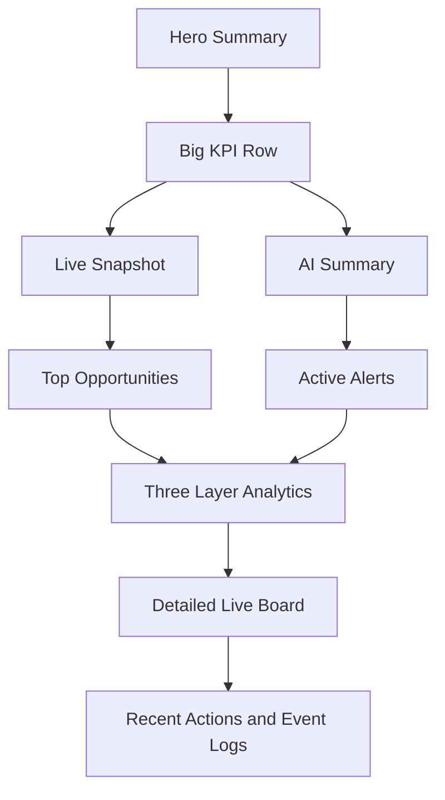

# Dashboard 首屏改版方案：經理人導向 Hero + KPI + AI Summary

## 1. 背景與核心決策

- 使用者回饋：目前 Dashboard 首屏是以商品卡片區為主，打開後沒有視覺重點。
- 本次方向確認為：**首屏改成經理人導向**。
- 核心策略：
  1. 首屏先講商業價值
  2. 先讓主管看到重點，再讓操作人員下鑽
  3. 目前的 [`#dashboard`](../public/index.html) 商品卡片區，從主角降級為 **次要縮圖 Snapshot** 或第二屏 Live 區塊

---

## 2. 現況問題診斷

### 2.1 視覺重心放錯地方

- 現況在 [`#dashboardView`](../public/index.html) 首屏中，最大面積給了 [`#dashboard`](../public/index.html) 商品卡片區。
- 對經理人來說，這種商品卡片密度比較像現場操作畫面，不像決策總覽。
- 結果是：
  - 有資料，但沒有故事
  - 有卡片，但沒有主訊息
  - 有即時狀態，但沒有優先順序

### 2.2 KPI 存在，但沒有形成管理語境

- 目前 KPI 雖然在上方，但仍被同一張大卡中的商品區稀釋。
- KPI 也偏系統狀態描述，例如總商品數、結帳區件數，較不像管理者第一眼最在意的商業摘要。

### 2.3 缺少高階摘要區

- 根據 [`規格書 3.0/UI規格書 3.0.md`](../規格書%203.0/UI規格書%203.0.md)，Overview 首屏應該先有 Hero 區與 AI Summary。
- 目前首屏缺少：
  - 一句話說明今天門市表現
  - 異常與機會的高階摘要
  - 可讓主管 3 秒理解的閱讀動線

### 2.4 技術與操作內容過早暴露

- [`Recent Actions`](../public/index.html) 與 [`Latest Event Logs`](../public/index.html) 屬於偏操作或技術資訊。
- 若放在主閱讀路徑太前面，會讓經理人首屏失焦。

---

## 3. 新首屏目標

首屏應只回答四件事：

1. **今天試衣有沒有在發生**
2. **試衣有沒有轉成成交**
3. **目前最大的風險或機會是什麼**
4. **系統建議下一步做什麼**

這四件事要在不看商品卡海的前提下完成。

---

## 4. 新的首屏資訊架構

## 4.1 首屏結構重排

### 第一層：Hero Summary

用途：先建立商業敘事與系統狀態。

- 左側
  - 主標題：Smart Fitting Room Overview
  - 副標：一句話說明 RFID 如何幫助試衣轉換與營運決策
  - 今日摘要句：例如「Today conversion is stable, but size M demand is under pressure」
- 右側
  - Live store status
  - RFID tracking status
  - AI assistant status

### 第二層：大 KPI Row

用途：經理人第一眼看數字。

建議首屏保留 **4 張大卡**，不要 8 張平均分散注意力。

#### P0 KPI

1. Today Try-Ons
2. Try-On Conversion Rate
3. Active Alerts
4. Opportunity Items

#### P1 KPI

- Sold Today
- In Fitting Now
- Average Fitting Time
- Potential Opportunity Value

> 原則：首屏只放 P0，P1 放在第二列次級 KPI 或模組內。

### 第三層：雙欄核心內容

#### 左欄：Live Store Snapshot

- 不是現在的完整商品卡片牆
- 改成縮圖式 overview
- 只呈現：
  - Rack / Fitting / Checkout 的總量
  - 使用中的房間數
  - 移往 checkout 的流動件數
  - 少量代表性商品，不列出全部商品卡

#### 右欄：AI Summary Card

- 這塊要成為首屏第二視覺焦點
- 內容格式建議：
  - 1 條今日總結
  - 2 條風險提醒
  - 1 條建議動作
- 下方按鈕：
  - View full insights
  - Ask AI

### 第四層：Manager Action Row

#### 左欄：Top Opportunities

- 顯示 3 到 5 個最值得關注的商品或款式
- 每列只顯示：
  - 商品名
  - Try-On
  - Conversion
  - 問題標籤
  - 建議動作

#### 右欄：Active Alerts

- 顯示最多 3 到 5 則
- 每則都必須有建議動作
- 這區不做複雜圖，而是高密度決策卡

### 第五層：Below the fold 詳細層

首屏以下才放：

- 三層分析模組
- 完整 Live Board
- Recent Actions
- Event Logs

---

## 5. 版面藍圖

---

## 6. 區塊取捨原則

## 6.1 首屏必須保留

- Hero Summary
- 4 張大 KPI
- AI Summary Card
- 縮圖式 Live Snapshot
- Opportunities 與 Alerts

## 6.2 首屏要降級

- 目前的完整 [`#dashboard`](../public/index.html) 商品卡片牆
  - 改為縮圖
  - 或移到首屏下方的 Detailed Live Board

## 6.3 首屏應延後

- [`Recent Actions`](../public/index.html)
- [`Latest Event Logs`](../public/index.html)
- 完整技術細節

## 6.4 不能再出現的問題

- 一打開就看到太多小卡片
- KPI 與 Live Board 混在同一視覺主區
- 主畫面沒有一句話總結今天狀況
- 管理者要自己推論什麼才是重點

---

## 7. 對現有頁面的具體改法

## 7.1 [`public/index.html`](../public/index.html)

建議重構順序：

1. 在 [`#dashboardView`](../public/index.html) 最上方新增 Hero 區
2. 將目前 KPI 由 8 張小卡改為 4 張大卡 + 2 到 4 張次級資訊
3. 將目前 [`#dashboard`](../public/index.html) 所在區塊拆成：
   - `overviewSnapshotCard`
   - `overviewAiSummaryCard`
4. 將目前完整商品卡片 Live Board 下移，改為 `detailedLiveBoardSection`
5. 將 [`Recent Actions`](../public/index.html) 與 [`Latest Event Logs`](../public/index.html) 下移到更後面

## 7.2 [`public/css/style.css`](../public/css/style.css)

需要新增的視覺策略：

- Hero 區大標與副標
- KPI 大卡等級明顯化
- 首屏雙欄與 8比4 欄寬配置
- AI Summary 卡片做出高階摘要感
- Live Snapshot 使用簡化區塊，不顯示大量商品卡
- Alerts 使用垂直色條與優先級標籤

## 7.3 [`public/js/main.js`](../public/js/main.js)

需要新增或調整的資料邏輯：

- 生成今日摘要句
- 生成 AI Summary fallback 文案
- 從完整商品卡資料聚合成 Snapshot 級摘要
- 重排 render 順序，先 render 首屏管理摘要，再 render 詳細區
- 讓完整 Live Board 可作為第二屏內容，而不是首頁主視覺

---

## 8. 建議 DOM 區塊命名

- `dashboardHeroSection`
- `heroNarrativeBlock`
- `heroStatusPills`
- `overviewPrimaryKpis`
- `overviewSecondaryKpis`
- `overviewSnapshotCard`
- `overviewAiSummaryCard`
- `overviewOpportunityCard`
- `overviewAlertCard`
- `detailedLiveBoardSection`

---

## 9. Code mode 可直接執行的清單

- 將 [`public/index.html`](../public/index.html) 首屏重構成 Hero → KPI → Snapshot and AI → Opportunities and Alerts
- 將目前完整 [`#dashboard`](../public/index.html) 改成縮圖 Snapshot 或移至第二屏
- 將 [`public/css/style.css`](../public/css/style.css) 補上 Hero 視覺層級與大 KPI 卡樣式
- 將 [`public/js/main.js`](../public/js/main.js) 新增 `renderHeroSummary`、`renderAiSummaryCard`、`renderLiveSnapshot`
- 將 `Recent Actions` 與 `Event Logs` 移到詳細層
- 補上各區空資料狀態與 fallback 文案

---

## 10. 驗收標準

- 打開 Dashboard 後，3 秒內可看懂今日營運狀態
- 首屏第一視覺焦點不是商品卡海，而是 Hero 與 KPI
- AI Summary 成為右上核心摘要，不再只是次級資訊
- Live Store 以 Snapshot 呈現，不再吃掉首屏最大面積
- Opportunities 與 Alerts 可以直接支持管理決策
- Recent Actions 與 Event Logs 退到次要層級

---

## 11. 最終建議

如果目標是 **經理人導向**，那 Dashboard 首屏不應該是「商品目前在哪裡」，而應該是：

**今天試衣表現如何、哪裡有機會、哪裡有風險、系統建議怎麼做。**

換句話說：

- 首屏是 **Overview**
- 商品卡片牆是 **Live Detail**

這兩者都重要，但不能放在同一個視覺優先級。
