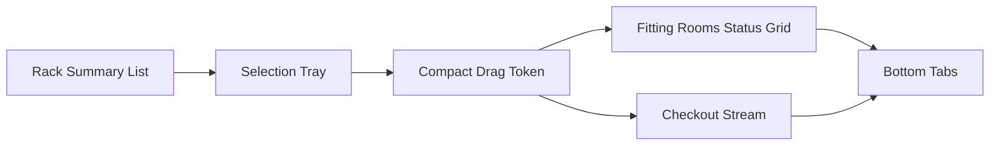

# Fitting Demo UI 簡化與產品展示優化規劃書 v1

## 1. 規劃定位

本規劃以 [規格書 3.0/fitting room UI 3.1.md](規格書 3.0/fitting room UI 3.1.md) 為主體，前提是保留既有三欄大架構與事件規則，不推翻整體流程，只針對你指出的兩個核心問題做優化：

- 產品表示方式過於複雜
- 畫面佔用過大，影響操作流暢度

本版目標不是重做 IA，而是將畫面由資料導向卡片堆疊，改成操作導向的漸進揭露介面。

---

## 2. 不變項

以下內容維持不變：

- 保留三欄主區與底部資訊區，對齊 [規格書 3.0/fitting room UI 3.1.md:63](規格書 3.0/fitting room UI 3.1.md:63)
- 保留合法拖拉路徑與事件映射，對齊 [規格書 3.0/fitting room UI 3.1.md:178](規格書 3.0/fitting room UI 3.1.md:178)
- 保留資料命名與事件語意，對齊 [規格書 3.0/資料欄位規格書 3.0.md:218](規格書 3.0/資料欄位規格書 3.0.md:218)
- 保留目前頁面骨架 [public/fitting-demo.html](public/fitting-demo.html)
- 保留當前互動主軸，也就是 Rack 選品、選 size、拖到 Room 或 Checkout

換句話說，這份規劃是 UI 精簡與節奏優化，不是資料模型或流程邏輯重寫。

---

## 3. 現況問題診斷

### 3.1 Rack 卡片資訊過滿

目前 [RackItemCard](public/js/fitting-demo.js:444) 同時展示圖片、商品名、顏色、Item No、Available、Style No 與低庫存標示。對 Demo 操作來說，這些欄位不在同一優先級，導致左欄每張卡片高度偏大，單屏可見數量偏少。

### 3.2 選取詳情區重複敘事

目前 [SelectedItemDetailPanel](public/js/fitting-demo.js:515) 會再次展示大圖、Style、Item、Color、總庫存、Size Selector、Selected Variant 明細、可拖曳卡片。這形成兩個問題：

- 與 Rack 卡片重複展示商品身份資訊
- 拖曳前需要先閱讀太多內容，增加操作成本

### 3.3 可拖曳物件過像資訊卡，不像操作物件

目前 [SelectedVariantCard](public/js/fitting-demo.js:495) 仍採完整卡片形式，包含圖片、名稱、SKU、Available 與狀態 pill。這對拖拉互動而言過重，使用者真正需要的是確認目前選的是哪個 size，以及此物件可被拖曳。

### 3.4 Room 內 item 視覺層級過高

目前 [RoomCard](public/js/fitting-demo.js:555) 會把每件 item 都渲染成獨立卡片，並顯示名稱、SKU、Dwell、Overdue。當一個房間有多件商品時，中欄容易變成資訊牆，弱化房間狀態本身。

### 3.5 底部區塊掃讀成本偏高

目前 [RecentEventsTable](public/js/fitting-demo.js:604) 與 [RoomSummaryPanel](public/js/fitting-demo.js:620) 同時展開，且 Room Summary 直接列出 Active Item Names，對展示流程而言資訊密度偏高，會搶走主操作區注意力。

### 3.6 樣式密度與版面比例尚未服務操作優先級

目前 [.frd-main](public/css/style.css:1369) 採 30 40 30，左欄又同時放 Rack 與 Selected Detail；而 [.frd-selected-detail](public/css/style.css:1465) 最低高度達 280px，會壓縮清單可視範圍。這是造成操作流暢度下降的主要版面原因之一。

---

## 4. 改版核心原則

### 4.1 漸進揭露

先讓使用者做決策，再看細節；不是先看到所有細節，再決定怎麼操作。

### 4.2 操作物件優先於資料物件

拖拉頁的主角應是可操作的選取結果，而不是完整商品資料卡。

### 4.3 單屏完成主要任務

使用者應在不明顯滾動的前提下完成以下主流程：

- 選商品
- 選 size
- 拖曳到 Room 或 Checkout

### 4.4 房間先看狀態，再看內容

Room 是流程節點，不是商品列表容器。房間資訊應先呈現 occupancy、alert、dwell 狀態，再視需要展開 item 細節。

---

## 5. 新 UI 提案

## 5.1 版面比例微調

維持三欄，但建議由 30 40 30 改為：

- Rack 24
- Fitting Rooms 52
- Checkout 24

原因：

- 中欄才是拖拉落點與主要流程舞台
- 左右欄應改成精簡資訊與輔助操作區
- 視覺重心回到 Room 與移動結果

## 5.2 Rack 區改為緊湊型清單

將 [RackItemCard](public/js/fitting-demo.js:444) 改為 summary row，而非資訊卡。

每列只保留高優先資訊：

- 小圖
- 商品名
- Color
- Available 數量
- Low stock 標示

預設隱藏或降權資訊：

- Item No
- Style No
- 其他識別欄位

建議表現方式：

- 主標一行
- 次資訊一行
- 數量與警示以 badge 呈現
- hover 或選中時才顯示補充欄位

### 修改價值

- 左欄單屏可見更多商品
- 降低使用者在選品前的閱讀負擔
- 讓 Rack 更像選擇器，而不是商品詳情頁

## 5.3 選取詳情區改為 Selection Tray

將 [SelectedItemDetailPanel](public/js/fitting-demo.js:515) 從大塊詳情卡改為緊湊型 Selection Tray。

建議結構：

- 第一列：已選商品名 + color
- 第二列：size chips
- 第三列：目前選定 size 的可拖曳 token

移除或延後顯示：

- 大圖
- `dl` 明細欄位
- 重複的 Style / Item / Total available 長段文字

Selection Tray 應該是：

- 固定在 Rack 底部或欄位中段
- 高度可控
- 選 size 後立即出現 drag token

### 修改價值

- 使用者一眼只看到下一步要做什麼
- 避免目前從選品到拖曳之間的資訊斷層
- 降低左欄視覺高度，保留更多 Rack 可視區

## 5.4 可拖曳物件改為 Compact Drag Token

將 [SelectedVariantCard](public/js/fitting-demo.js:495) 由完整卡片改為緊湊拖曳條。

建議內容：

- 商品名縮寫或主名稱
- size badge
- quantity badge
- drag handle icon 或 Drag to room 文案

不再預設顯示：

- 大圖
- SKU 全碼主視覺
- 多行 meta

### 修改價值

- 拖拉物件更像動作入口
- 明顯降低視覺重量
- 提升拖拉前的理解速度

## 5.5 Room 卡改為狀態卡 + 緊湊商品卡

保留 [RoomCard](public/js/fitting-demo.js:555) 內的商品卡概念，但不再使用目前這種每件商品都像獨立資訊卡的表現方式，而是改成更緊湊、偏操作導向的 room item mini card。

建議結構分成兩層：

第一層固定可見：

- Room 名稱
- occupancy
- session 狀態
- overdue 標示
- 最長 dwell 或主要 dwell 指標

第二層保留商品卡，但縮成 compact card：

- 單列或雙列緊湊排列
- 保留商品名
- 保留 size badge
- 保留 dwell
- overdue 改為小型警示 badge
- SKU 全碼降級為次要資訊，必要時才顯示
- 移除多餘留白與過高卡片 padding

建議 compact card 高度控制原則：

- 一張卡盡量維持 2 行內容內完成
- 圖片改為可選，小圖示或縮圖即可，不使用大圖
- 主要資訊放在第一行，狀態資訊放在第二行

當 room 內商品數量增加時，採以下策略：

- 預設顯示前 2 張緊湊商品卡
- 超過 2 張時顯示 `+N more`
- 點擊 room 卡或展開鍵後，才展開完整清單

### 修改價值

- 保留你要的商品存在感，不會讓 room 變成只有抽象狀態框
- 仍可快速判讀 room 裡面有哪些品項
- 相較目前 [RoomCard](public/js/fitting-demo.js:555) 的完整卡片堆疊，能顯著降低中欄高度與干擾
- 中欄仍以房間狀態為主，但不犧牲商品可見性

## 5.6 Checkout 改為交易摘要流

目前 [CheckoutListPanel](public/js/fitting-demo.js:588) 已相對簡潔，但仍可再收斂為時間序交易流。

建議調整：

- 保留最近 5 筆完整顯示
- 超過 5 筆以 View older 收合
- sale type badge 保留
- 次資訊只保留 size 與 time

### 修改價值

- 降低右欄向下生長的高度
- 保持成交結果可見，但不壓迫主互動區

## 5.7 Bottom Area 改為 Tabs 而非雙表並列

目前底部同時展示 Recent Events 與 Room Summary。建議保留兩份資料，但改成 tab 切換：

- Tab 1 Recent Events
- Tab 2 Room Summary

Room Summary 預設僅顯示：

- room
- item count
- session status
- longest dwell

不再預設列出完整 Active Item Names。

### 修改價值

- 降低畫面長度與資料噪音
- 讓主操作流程保持焦點
- 保留管理與 demo 說明所需資訊

---

## 6. 建議資訊層級

### Level 1 立即可見

- 商品名
- color
- size
- available
- room occupancy
- overdue
- sale type

### Level 2 選中後可見

- item no
- style no
- sku_ean13
- 單價

### Level 3 點擊展開才可見

- 完整 session 細節
- 房內完整 item 清單
- 歷史事件明細

---

## 7. 建議流程線框

---

## 8. 對現有檔案的調整建議

## 8.1 [public/fitting-demo.html](public/fitting-demo.html)

建議調整：

- 左欄由 Rack List + Large Detail 改為 Rack List + Compact Selection Tray
- 底部資訊區由雙欄常駐改為 tabs 容器
- Checkout 保留 drop zone，但縮小說明文案區高度

## 8.2 [public/js/fitting-demo.js](public/js/fitting-demo.js)

優先重構的 render 區塊：

- [RackItemCard](public/js/fitting-demo.js:444)
- [SizeSelector](public/js/fitting-demo.js:471)
- [SelectedVariantCard](public/js/fitting-demo.js:495)
- [SelectedItemDetailPanel](public/js/fitting-demo.js:515)
- [RoomCard](public/js/fitting-demo.js:555)
- [CheckoutListPanel](public/js/fitting-demo.js:588)
- [RoomSummaryPanel](public/js/fitting-demo.js:620)

邏輯層原則：

- 保留拖拉合法路徑
- 保留事件命名
- 保留 rollback 機制
- 僅調整 render model 與視覺資訊層級

## 8.3 [public/css/style.css](public/css/style.css)

優先調整區塊：

- [.frd-main](public/css/style.css:1369) 版面比例
- [.frd-rack-card](public/css/style.css:1408) 改為更低高度 summary row
- [.frd-selected-detail](public/css/style.css:1465) 改為緊湊 tray
- [.frd-variant-card](public/css/style.css:1574) 改為 token 式拖曳物件
- [.frd-room-item](public/css/style.css:1684) 改為 compact room product card 樣式
- [.frd-bottom](public/css/style.css:1713) 改為 tabbed info area

---

## 9. 驗收標準

- 使用者進入頁面後，主要視線先落在 Room 與可拖曳流程，而不是大面積商品細節
- Rack 單屏可見商品數量明顯提升
- 選品與選 size 後，不需閱讀長段資料即可開始拖曳
- Room 多件商品時仍能快速判讀房間狀態，且仍看得到緊湊版商品卡
- Checkout 與 Bottom Area 不會壓縮主互動空間
- 合法拖拉、非法拖拉、toast、事件映射行為維持既有規格

---

## 10. Code 模式執行清單

- [ ] 將左欄改為 summary rack list + compact selection tray
- [ ] 將 selected variant 改為 compact drag token
- [ ] 將 room item card 改為 compact room product card 與可展開細節
- [ ] 將 checkout list 改為最近交易摘要流
- [ ] 將 bottom area 改為 Recent Events 與 Room Summary tabs
- [ ] 調整三欄比例與密度樣式，確保主操作區優先
- [ ] 驗證拖拉合法矩陣、事件名稱、rollback 與 toast 未被破壞

---

## 11. 結論

從專業 UIUX 與企業展示角度來看，你目前的大架構是合理的，真正需要修的是「資訊露出節奏」而不是「系統結構」。

最值得優先做的不是新增更多元件，而是把目前過重的產品卡、選取詳情卡、房間內 item 卡全部降階，改成：

- Rack summary
- Selection tray
- Compact drag token
- Room status first + compact product cards
- Bottom tabs

這樣可以同時達成三個效果：

- 畫面更乾淨
- 操作更直接
- Demo 更像產品，而不是資料檢視工具
