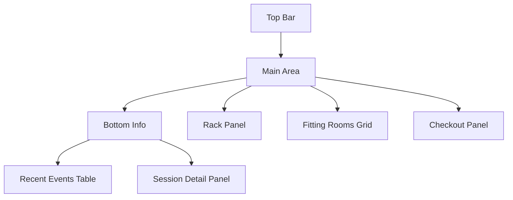
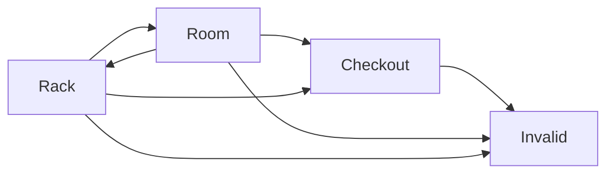

# Fitting Room Demo UI/UX 線框與元件規劃 v3

## 1. 規劃目標

- 新增獨立頁：`/fitting-demo.html`
- 聚焦 UI/UX 與互動流程：Top Bar、三欄拖拉區、Bottom Information Area
- 拖拉成功即時送出 `POST /api/rfid-webhook`
- Recent Events 以真實事件資料為主
- 視覺維持 enterprise SaaS，沿用現有設計 token

---

## 2. 頁面資訊架構

### 2.1 Top Bar

- 左側
  - 標題：Fitting Room Demo
  - 副標：Drag items through the try-on and purchase journey
- 右側
  - Reset Demo
  - Seed Scenario
  - Active Alerts badge
  - Demo Controls 可選

### 2.2 Main Drag-and-Drop Area 三欄

- 左欄 Rack 28%
  - 顯示 `on_floor`
  - 可拖商品卡
- 中欄 Fitting Rooms 44%
  - 固定 4 間 Room，2 x 2
  - Room 僅接受 Rack 來源
- 右欄 Checkout 28%
  - 接受 Rack 與 Room 來源
  - 顯示成交清單與 sale type

### 2.3 Bottom Information Area

- Recent Events Table 必做
  - time, item, room, event_type, status
- Session Detail Panel 建議做
  - selected item, current zone, current room, entered_at, dwell, session status

---

## 3. 拖拉合法路徑矩陣與事件

| from | to | 合法 | 事件 | 其他行為 |
|---|---|---|---|---|
| Rack | Room | 是 | enter_room | 建立 session、item=in_room |
| Room | Rack | 是 | exit_room | 更新 session exited、item=on_floor |
| Room | Checkout | 是 | exit_room + sale_completed | session converted、sale try_on_purchase、item=sold |
| Rack | Checkout | 是 | direct_sale | 不建 session、sale direct_purchase、item=sold |
| 其他路徑 | 任意 | 否 | 無 | 回彈 + toast Invalid move |

---

## 4. 互動狀態與回饋

### 4.1 Drag life cycle

1. dragstart
   - card 進入 dragging
   - 僅合法目標高亮
2. dragover/enter
   - valid zone 顯示 active border
3. drop
   - 先做路徑驗證
   - 合法才送 webhook
4. 成功
   - 更新畫面資料
   - 顯示 success toast
5. 失敗
   - 還原位置
   - 顯示 error toast

### 4.2 Toast 建議字串

- Item entered fitting room
- Item returned to rack
- Purchase completed
- Direct purchase completed
- Invalid move
- Action could not be completed

---

## 5. 元件拆分與責任邊界

## 5.1 頁面層

- `FittingRoomDemoPage`
  - 組頁、狀態總管、拖拉協調、資料 refresh

### 5.2 區塊層

- `DemoTopBar`
- `RackPanel`
- `FittingRoomsGrid`
- `CheckoutPanel`
- `BottomInfoArea`

### 5.3 卡片/列表層

- `DraggableItemCard`
- `RoomCard`
- `SaleRecordItem`
- `RecentEventsTable`
- `SessionDetailPanel`
- `ToastStack`

### 5.4 邏輯層

- `dragRules`
  - 路徑判斷 `isValidMove from to`
  - 路徑映射 `resolveEventPlan`
- `demoStateMapper`
  - API 回傳轉成 UI 所需欄位
- `demoApi`
  - `postRfidEvent`
  - `fetchRecentEvents`
  - 可擴充 `fetchBoardSnapshot`

---

## 6. 資料模型 for UI

```txt
Item
- id
- product_name
- color
- size
- sku_short
- status on_floor in_room sold
- room_id nullable

Room
- id
- name
- items
- occupancy
- is_overdue

Session
- id
- item_id
- room_id
- entered_at
- exited_at
- dwell_seconds
- status active exited converted

Event
- id
- time
- item
- room
- event_type
- status

Sale
- id
- item_id
- time
- sale_type try_on_purchase direct_purchase
```

---

## 7. 與現有專案整合策略

- 新增 `public/fitting-demo.html` 作為獨立入口
- 由 `public/js/main.js` 增加 page bootstrap 分流
- 由 `public/css/style.css` 新增命名空間樣式
  - 建議前綴 `.fitting-demo-*` 避免影響既有 dashboard
- Home 導航加一張卡或連結到 `/fitting-demo.html`

---

## 8. Wireframe Mermaid





---

## 9. Code 模式執行清單

1. 建立 `fitting-demo.html` 頁面骨架與區塊容器
2. 建立 Fitting Demo 專用 DOM 綁定與初始化流程
3. 實作元件 render 函式與空狀態
4. 實作 drag rules 與合法目標高亮
5. 實作 drop 成功後 webhook 呼叫與 optimistic 更新
6. 實作失敗回滾與錯誤 toast
7. 實作 Recent Events 真實資料載入與刷新
8. 實作 sale type badge 區分
9. 補齊樣式與響應式退化
10. 依 10 條驗收逐項手測

---

## 10. 驗收對照

1. 三欄頁面可見
2. Rack 商品可拖
3. 4 Rooms 可 drop
4. Checkout 接受 Rack 與 Room
5. 非法拖拉回彈
6. 成功拖拉更新畫面
7. 可區分 Try-On 與 Direct Purchase
8. Recent Events 反映行為
9. 視覺一致
10. 程式結構可擴充
