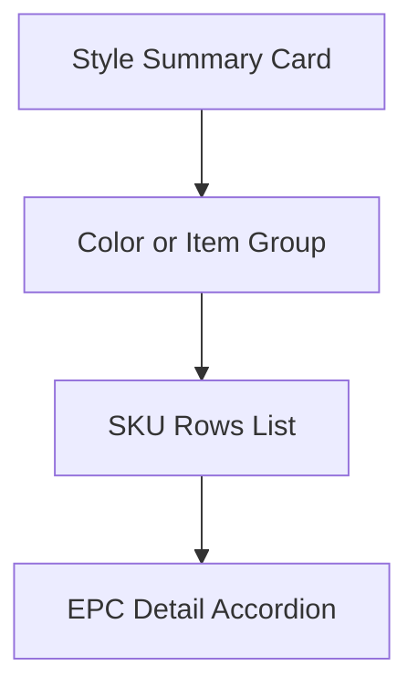

# Product Inventory / RFID Product Display 重構計畫

## 1. 目標與約束

- 重構範圍限定前端展示層：`public/product.html`、`public/js/main.js`、`public/css/style.css`
- 保持既有資料來源與後端模型不變：沿用 `buildSkuSummaryRows` 產出的資料集合
- 展示從 raw SKU 堆疊改為四層架構：Style Summary > Color/Item Group > SKU Rows > EPC Detail
- 互動預設：Style 與 Color 預設展開，EPC Detail 預設收合

## 2. 現況摘要

- 目前主要渲染由 `renderProductSkuSummary` 分流到 `renderLegacySkuSummary` 或 `renderNestedSkuSummary`
- `renderNestedSkuSummary` 已有 style/color/size 層級，但視覺仍偏同層卡片堆疊
- EPC 明細以 `
` 展開，仍缺乏主次視覺節奏
- 現有主題 token 已接近企業配色，需進一步套用到新分層元件

## 3. 新資訊架構與資料映射

### Layer 1: Style Summary Card

每個 style 卡需顯示：

- Style No
- Style or Product Name
- Color count
- SKU count
- Total inventory
- Sold quantity
- Price range

資料來源策略：

- 由 summary rows 依 `styleNo` 聚合
- `productName` 採 style 內最大覆蓋或第一個有效名稱
- `price range` 取 style 內所有有效 price 的 min/max

### Layer 2: Color or Item Group

每個 style 下以 `itemNo + color` 作為群組鍵，避免同色不同 item 混併。

每組顯示：

- Item No
- Color swatch + color name
- Size count
- Total inventory
- Sold quantity

### Layer 3: SKU Rows

每個 color group 顯示緊湊列，欄位：

- SKU
- Size badge
- Price
- Inventory
- Sold
- EPC count
- Expand action

### Layer 4: EPC Detail

- 每一個 SKU row 有自己的 EPC 折疊內容
- EPC 區塊預設收合
- 展開後顯示 table 欄位：EPC、Current Location、Status、Last Seen 目前預留

## 4. 配色策略對應

沿用並明確套用以下 token：

- pageBg `#F8FAFC`
- pageBgAlt `#F1F5F9`
- cardBg `#FFFFFF`
- cardBorder `#E2E8F0`
- divider `#CBD5E1`
- textPrimary `#0F172A`
- textSecondary `#475569`
- textMuted `#64748B`
- primary `#2563EB`
- primarySoft `#DBEAFE`
- success `#16A34A`
- warning `#D97706`
- danger `#DC2626`

套用規則：

- 頁面背景：linear gradient，由 `pageBg` 到 `pageBgAlt`
- Style 卡：`cardBg` + `cardBorder`，可加極淡 `primarySoft` 頂部 accent
- Color group：`#F8FAFC` 區塊底 + 左側 color dot
- SKU row：白底或極淡底，hover 時 `primarySoft` 淡高亮
- EPC detail：最淡底色與細分隔線，避免搶主資訊

## 5. 元件重構清單

### A. `public/js/main.js`

新增/調整函式：

- `buildStyleHierarchyFromSummaryRows(rows)`
  - 將扁平 `summaryRows` 轉為 style -> group -> sku -> epc hierarchy
- `renderEnterpriseProductSummary(rows, conflictHtml)`
  - 新企業版主渲染器，取代現有 nested 視圖輸出
- `renderStyleSummaryCard(styleNode)`
- `renderColorGroup(colorGroupNode)`
- `renderSkuRow(skuRow)`
- `renderSkuEpcTable(skuRow)`
- `inferColorSwatchHex(colorName)`
  - 顏色名稱到 swatch 顯示色的輕量映射
- `buildPriceRangeDisplay(minPrice, maxPrice)`

行為調整：

- `renderProductSkuSummary` 在 nested 模式呼叫新企業版渲染器
- 保留 `sku/nested` toggle，不破壞既有使用習慣
- 將 nested 預設視為主建議視圖可於後續再決定是否改預設

### B. `public/css/style.css`

新增區塊樣式：

- enterprise summary 容器與間距節奏
- style card、style header、style KPI chips
- color group 容器與左側 accent
- color swatch dot
- size badge
- SKU row grid 與數字欄位 hierarchy
- low stock warning badge
- EPC details table 視覺降權

調整既有樣式：

- 降低 `.product-sku-col--sku` 權重
- 強化 product or style name 層級
- 將高權重色集中在重點數據與互動元素

### C. `public/product.html`

最小化調整：

- 保留既有 filter toolbar 區塊
- 補上可擴充 filter 區域容器 class，預留 color/size/status
- 視需要調整段落文案，以符合新四層敘事

## 6. 互動與預設展開

- Style：預設展開
- Color group：預設展開
- EPC detail：預設收合
- Hover：
  - style card hover 邊框與陰影輕微提升
  - sku row hover 淡底色提示
- Expand action：以文字按鈕或小型 chevron，不使用高干擾主色大按鈕

## 7. 搜尋與篩選規劃

保留現有：

- style_no filter
- item_no filter

預留後續欄位：

- color
- size
- inventory status normal or low

實作方式：

- 新增 toolbar 附加區塊 class 與 placeholder 控制，不改動資料模型

## 8. 驗收清單

- 使用者先看到 style 摘要，再看到 color group，再看到 SKU rows，最後才看到 EPC
- SKU 視覺權重低於 product name
- EPC 全部預設收合
- Inventory 或 Sold 可快速掃讀，且 low stock 可辨識
- Color 有 swatch + 文字
- Size 以 badge 顯示
- 整體配色符合低干擾 enterprise SaaS 風格

## 9. 實作順序

1. 在 `main.js` 完成 hierarchy builder 與 enterprise renderer
2. 接入 `renderProductSkuSummary` nested 分支
3. 在 `style.css` 新增 enterprise 分層樣式並調整既有衝突樣式
4. 在 `product.html` 補上 toolbar 擴充容器與文案
5. 校正 i18n key 新增字串
6. 手動檢查展開預設與響應式行為

