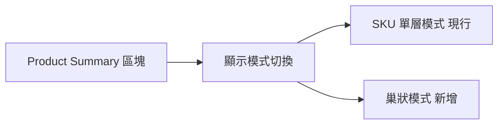
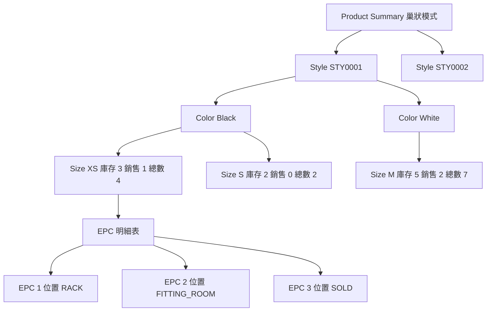

# Product 頁面巢狀顯示示意圖

## 顯示模式切換

## 巢狀模式結構

## 互動規則

- 預設顯示 [`SKU 單層模式`](public/js/main.js:2312)
- 可由切換按鈕進入巢狀模式
- 巢狀模式允許多節點同時展開
- 巢狀模式預設全部收合
- 排序規則為 style_no 升冪 → color 升冪 → size XS S M L XL 優先 其餘自然排序
