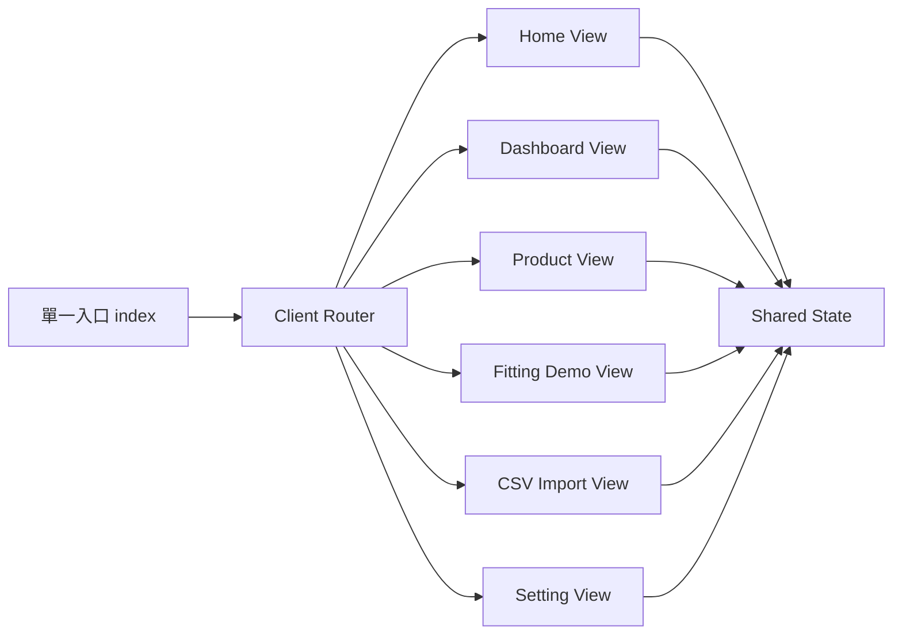

# 介面重構方案：由多 HTML 切換改為單一 App Shell

## 1. 目前狀態摘要

- 目前入口頁已經在同頁內切換部分畫面，例如登入、首頁與 Dashboard
- Product、Fitting Demo、CSV Import、Setting 仍以不同 HTML 分頁跳轉
- 導航切換主要由前端 JavaScript 直接改寫 URL 觸發頁面重載
- 部署端已有部分 rewrite 設定，代表路由整理可以和部署調整一起規劃

這代表系統現況不是純多頁，也不是完整單頁，而是介於兩者之間的混合模式。這種模式在早期可快速推進，但後續容易遇到：

- 導航體驗不一致
- 共用狀態重建成本高
- Header 與導覽元件重複維護
- 語系、登入、連線狀態在不同頁面難以完全同步

## 2. 方案總覽

### 方案 A：維持原生 JavaScript，改成單一 App Shell + Client Router

#### 做法

- 保留 `public/index.html` 作為唯一入口
- 將 Home、Dashboard、Product、Fitting Demo、CSV Import、Setting 切成可掛載 view 模組
- 新增前端 router 管理 URL 與畫面切換
- 將登入、語系、Supabase 連線、共用設定抽成共享 state
- 舊頁先保留，逐步改為導向新入口

#### 優點

- 不必一次導入新框架，對現有程式影響最小
- 可直接沿用既有 DOM 與業務邏輯
- 重構節奏可控，適合漸進式搬遷
- 可明顯改善切頁體驗與狀態保存

#### 代價

- Router、state、view lifecycle 要自行定義
- 若未來模組快速增加，原生架構仍可能逐漸變重

#### 適用情境

- 希望先改善 UX 與維護性
- 不想在此階段引入完整前端建置鏈
- 想以最低風險把現有頁面整併

---

### 方案 B：導入前端框架，重做為標準 SPA

#### 建議技術組合

- Vue 3
- Vue Router
- Pinia
- Vite

#### 做法

- 以框架重建畫面層
- 各模組改成獨立 component 與 route
- 狀態、表單、權限、語系與 API 呼叫全面模組化

#### 優點

- 可維護性最高
- 擴充新模組最方便
- 元件重用、狀態管理、測試與長期治理最完整

#### 代價

- 重構成本最高
- 需要導入建置流程與新開發規範
- 現有原生 DOM 操作需大量改寫

#### 適用情境

- 專案將持續擴充成正式產品
- 後續會再加入更多模組、角色與流程
- 團隊願意接受框架與建置工具鏈

---

### 方案 C：保留多頁架構，只做共用殼層與樣板抽離

#### 做法

- 保留多個 HTML 檔
- 抽共用 header、top nav、session boot、language boot
- 用共用 script 處理導航 active state 與初始化

#### 優點

- 風險最低
- 修改範圍最小
- 可快速整理重複區塊

#### 代價

- 仍是分頁 reload
- 共用狀態仍會重建
- 使用者體驗提升有限
- 後續再往 SPA 演進時仍需再次重構

#### 適用情境

- 當前只允許小幅整理
- 優先目標是先降低重複碼，而不是提升導航體驗

## 3. 專業建議

### 建議採用：方案 A

原因如下：

1. 現況已經有同頁 view 切換基礎，表示架構自然適合往單一 App Shell 演進
2. 現有專案尚未建立完整前端框架與建置鏈，直接跳到方案 B 會拉高重構風險
3. 方案 A 可以先改善操作體驗，再保留未來升級到框架的空間

### 不建議採用：iframe 或 frame

原因如下：

- 登入狀態、語系、權限與事件同步會變複雜
- 鍵盤操作、返回行為與焦點管理較差
- 監控、除錯與維護成本偏高
- 對未來整體產品化幫助有限

## 4. 推薦目標架構

### 建議模組拆分

- `public/index.html`
  - 唯一入口與共用 shell
- `public/js/router.js`
  - 管理路由、pushState、popstate、deep link
- `public/js/app-shell.js`
  - 掛載 header、navigation、layout 容器
- `public/js/state/session-store.js`
  - 管理登入 session、角色、語系、Supabase 設定
- `public/js/views/home-view.js`
- `public/js/views/dashboard-view.js`
- `public/js/views/product-view.js`
- `public/js/views/fitting-demo-view.js`
- `public/js/views/csv-import-view.js`
- `public/js/views/setting-view.js`

## 5. 建議修改步驟

### 階段 1：先建立 Shell 與 Router

- 以 `public/index.html` 為唯一入口
- 建立 route map
- 將首頁卡片點擊由整頁跳轉改成 router navigation
- 支援網址直入與重新整理後保留目前模組

### 階段 2：抽出共用狀態層

- 集中管理 localStorage key
- 集中管理登入狀態
- 集中管理語系切換
- 集中管理 Supabase 初始化與連線狀態

### 階段 3：搬移各模組畫面

- 先搬 Product 與 Setting，因為畫面邏輯相對集中
- 再搬 CSV Import
- 最後搬 Fitting Demo，因為互動較重

### 階段 4：整理共用導覽與頁首

- 合併重複 header
- 合併 top nav
- 建立 route-aware active state
- 將頁面標題、副標、動作按鈕標準化

### 階段 5：部署與回溯相容

- 調整 Vercel rewrite，讓所有前端路由回到單一入口
- 保留舊路徑轉址或 rewrite，避免既有書籤失效
- 過渡期可保留舊 HTML，內容只做 redirect 到新路由

## 6. 建議優先順序

1. 先完成 Router 與 App Shell
2. 再完成共享狀態層
3. 再搬 Product、Setting、CSV Import
4. 最後搬 Fitting Demo
5. 驗證穩定後再移除舊 HTML

## 7. 驗證清單

- 登入後不必整頁重載即可切換模組
- 語系切換後在所有模組一致生效
- 切換模組時 Supabase 連線與 session 不重建
- 重新整理後仍能停留在目前路由
- 直接輸入路由可正確進入指定模組
- 舊網址仍能正常導到新入口
- Dashboard、Product、Fitting Demo、CSV Import、Setting 皆可從同一殼層切換

## 8. 最後結論

若以目前專案成熟度、現有原生 JavaScript 結構與風險控制來看，最合適的修改方案是：

**先採用方案 A，將現有系統整理成單一 App Shell + Client Router 的漸進式 SPA。**

這能在不大幅重寫業務邏輯的前提下，顯著提升：

- 切換流暢度
- 狀態延續性
- 導航一致性
- 後續維護與擴充能力

若未來確認此系統要長期產品化，再從方案 A 平滑升級到方案 B，會是更穩健的技術路線。

## 9. 方案 A 的檔案級別改造清單

以下清單以「先建立骨架、再遷移模組、最後收斂舊頁」為原則，目標是不一次打爆 [`public/js/main.js`](public/js/main.js) 與既有流程。

### 9.1 入口與殼層

#### [`public/index.html`](public/index.html)

**角色調整**

- 由目前首頁加 Dashboard 容器，提升為唯一入口頁
- 保留登入區與共用 App Shell 容器
- 新增統一的 route outlet 容器
- 將各模組頁面的共用 header 與 nav 併入此檔或由 shell 動態掛載

**需修改內容**

- 保留 [`#loginView`](public/index.html:10)
- 保留 [`#appShell`](public/index.html:29)
- 將 [`#homeView`](public/index.html:30) 與 [`#dashboardView`](public/index.html:67) 重構成 route view 容器
- 新增類似 `#appHeader`、`#appNav`、`#routeOutlet` 的掛載節點
- 將目前只存在於 [`public/product.html`](public/product.html)、[`public/setting.html`](public/setting.html)、[`public/csv-import.html`](public/csv-import.html)、[`public/fitting-demo.html`](public/fitting-demo.html) 的必要結構拆成 partial 或 template

**預期結果**

- 所有模組均由同一 HTML 入口載入
- 重新整理任一模組時，仍回到同一殼層

---

### 9.2 路由與畫面生命週期

#### 新增 [`public/js/router.js`](public/js/router.js)

**職責**

- 管理路由表
- 管理 `pushState`、`replaceState`、`popstate`
- 對應路由到 view module
- 控制 route enter、leave、mount、unmount

**建議路由**

- `/`
- `/dashboard`
- `/product`
- `/fitting-demo`
- `/csv-import`
- `/setting`

**需承接現況**

- 取代 [`handleHomeCardNavigation()`](public/js/main.js:1130)
- 補上目前只有 [`navigateToDashboard()`](public/js/main.js:888) 與 [`navigateToHome()`](public/js/main.js:892) 的同頁切換能力
- 延伸 [`syncTopNavActiveState()`](public/js/main.js:1059) 成 route-aware 導航狀態同步

---

#### 新增 [`public/js/app-shell.js`](public/js/app-shell.js)

**職責**

- 掛載共用 header、top nav、狀態列
- 提供 route outlet
- 協調登入後顯示殼層、未登入顯示登入頁

**需承接現況**

- 吸收 [`setAppVisibility()`](public/js/main.js:877)
- 吸收 [`setMainView()`](public/js/main.js:882) 的顯示控制概念，但改為 route-based 顯示

---

### 9.3 共用狀態與設定

#### 新增 [`public/js/state/app-state.js`](public/js/state/app-state.js)

**職責**

- 集中保存目前分散在 [`public/js/main.js`](public/js/main.js) 的核心狀態
- 至少包含：`currentLang`、`currentMode`、`currentProductSummaryView`、`session`、`supabase client`、`connection status`

**來源**

- 目前 [`public/js/main.js`](public/js/main.js) 內的全域變數
- [`public/js/fitting-demo.js`](public/js/fitting-demo.js) 內自己的 `state` 與 Supabase 初始化

**目的**

- 避免切換模組時重建 session 與連線
- 提供所有 view 共用的 store

---

#### 新增 [`public/js/state/storage.js`](public/js/state/storage.js)

**職責**

- 收斂 localStorage key、預設值、讀寫函式
- 將目前分散在 [`public/js/main.js`](public/js/main.js:3) 到 [`public/js/main.js`](public/js/main.js:20) 與 [`public/js/fitting-demo.js`](public/js/fitting-demo.js:26) 到 [`public/js/fitting-demo.js`](public/js/fitting-demo.js:31) 的 key 與預設設定集中

**預期抽出項目**

- `supabaseUrl`
- `supabaseAnonKey`
- `rfid_poc_lang_v1`
- `rfid_poc_mode_v1`
- `rfid_poc_login_session_v1`
- `rfid_poc_api_token_v1`
- `rfid_poc_user_role_v1`

---

#### 新增 [`public/js/services/supabase-service.js`](public/js/services/supabase-service.js)

**職責**

- 統一 Supabase client 初始化
- 統一 realtime subscription 建立與釋放
- 統一 error handling 與連線狀態

**需承接現況**

- 從 [`public/js/main.js`](public/js/main.js) 抽出 `connectSupabase` 相關流程
- 與 [`public/js/fitting-demo.js`](public/js/fitting-demo.js:619) 的 [`initSupabase()`](public/js/fitting-demo.js:619) 合併，避免雙份初始化邏輯

---

### 9.4 共用 UI 元件

#### 新增 [`public/js/components/top-nav.js`](public/js/components/top-nav.js)

**職責**

- 建立統一導覽列
- 根據目前路由切換 active state
- 將原先分散在 [`public/product.html`](public/product.html:13)、[`public/setting.html`](public/setting.html:13)、[`public/csv-import.html`](public/csv-import.html:13)、[`public/fitting-demo.html`](public/fitting-demo.html:16) 的重複 nav 統一收斂

---

#### 新增 [`public/js/components/app-header.js`](public/js/components/app-header.js)

**職責**

- 統一頁首標題、副標、header actions
- 讓每個 view 只輸出自己的內容區，不再重複輸出整段 header

---

#### 新增 [`public/js/components/language-switcher.js`](public/js/components/language-switcher.js)

**職責**

- 承接 [`populateLanguageSelect()`](public/js/main.js:1042)
- 與 i18n 套用機制整合
- 切換語系時通知所有 active view 更新

---

### 9.5 View 模組化拆分

#### 新增 [`public/js/views/home-view.js`](public/js/views/home-view.js)

**來源**

- [`public/index.html`](public/index.html:30) 到 [`public/index.html`](public/index.html:65)

**職責**

- 呈現首頁模組卡片
- 將首頁卡片點擊改成呼叫 router，而非 `window.location`

---

#### 新增 [`public/js/views/dashboard-view.js`](public/js/views/dashboard-view.js)

**來源**

- [`public/index.html`](public/index.html:67) 到 [`public/index.html`](public/index.html:122)
- [`public/js/main.js`](public/js/main.js:2817) 的 [`renderDashboard()`](public/js/main.js:2817) 與相關 dashboard rendering 函式

**職責**

- 專職 Dashboard UI render
- 與資料查詢邏輯分離
- 保留 KPI、board、timeline、product detail overlay 等互動

---

#### 新增 [`public/js/views/product-view.js`](public/js/views/product-view.js)

**來源**

- [`public/product.html`](public/product.html:26) 到 [`public/product.html`](public/product.html:47)
- [`public/js/main.js`](public/js/main.js:2411) 到 [`public/js/main.js`](public/js/main.js:2745) 的 product summary rendering 函式

**職責**

- 管理 Product Inventory 畫面
- 管理 nested view 與 sku view 切換
- 管理 style no 與 item no 篩選

---

#### 新增 [`public/js/views/setting-view.js`](public/js/views/setting-view.js)

**來源**

- [`public/setting.html`](public/setting.html:25) 到 [`public/setting.html`](public/setting.html:56)
- [`public/js/main.js`](public/js/main.js:3512) 的 [`handleConfigSubmit()`](public/js/main.js:3512)

**職責**

- 管理 Supabase 設定表單
- 管理角色、API token、連線狀態與 event log 顯示

---

#### 新增 [`public/js/views/csv-import-view.js`](public/js/csv-import-view.js)

**來源**

- [`public/csv-import.html`](public/csv-import.html:24) 到 [`public/csv-import.html`](public/csv-import.html:73)
- [`public/js/main.js`](public/js/main.js:3533) 的 [`handleCsvImport()`](public/js/main.js:3533)
- grouped import 相關處理函式

**職責**

- 管理單檔 CSV 匯入
- 管理 grouped CSV preview 與 import

---

#### 新增 [`public/js/views/fitting-demo-view.js`](public/js/views/fitting-demo-view.js)

**來源**

- [`public/fitting-demo.html`](public/fitting-demo.html:31) 到 [`public/fitting-demo.html`](public/fitting-demo.html:97)
- [`public/js/fitting-demo.js`](public/js/fitting-demo.js:1499) 的 [`bootstrap()`](public/js/fitting-demo.js:1499) 與其渲染流程

**職責**

- 保留原 Fitting Demo 的拖放互動與 mock/db bootstrap
- 改成掛載在單一殼層內的模組
- 改用共享 session 與 Supabase client

**注意**

- 此模組互動最重，放在最後遷移

---

### 9.6 橋接與啟動程式

#### 調整 [`public/js/main.js`](public/js/main.js)

**最終定位**

- 不再維持超大型 all-in-one 腳本
- 漸進式收斂成 bootstrapping entry

**拆分方向**

- 保留初始化入口
- 把 login、session、router、i18n、dashboard render、product render、config、csv import 逐步拆出
- 短期可作為相容橋接層，讓舊函式委派到新模組

---

#### 調整 [`public/js/fitting-demo.js`](public/js/fitting-demo.js)

**最終定位**

- 由獨立整頁 bootstrap 腳本，改為可被 route mount 的模組

**拆分方向**

- 將 [`bootstrap()`](public/js/fitting-demo.js:1499) 改為 `mountFittingDemoView` 類型接口
- 將內部 `state` 與 `initSupabase` 改讀共享 state/service

---

### 9.7 舊頁與部署相容

#### 調整 [`vercel.json`](vercel.json)

**目標**

- 將前端路由回寫到單一入口
- 舊網址仍可使用

**建議處理**

- 保留 `/product`、`/csv-import`、`/setting`、`/fitting-demo`
- 統一 rewrite 到 [`public/index.html`](public/index.html)
- 舊 `.html` 路徑可先轉址到無副檔名新路徑

---

#### 保留但降階的舊頁檔案

- [`public/product.html`](public/product.html)
- [`public/setting.html`](public/setting.html)
- [`public/csv-import.html`](public/csv-import.html)
- [`public/fitting-demo.html`](public/fitting-demo.html)

**過渡用途**

- 初期可保留以避免外部書籤失效
- 中期改為簡單 redirect 頁
- 最終驗證完成後可移除或只保留 rewrite

## 10. 建議遷移順序

### Phase 0：盤點與凍結接口

1. 凍結目前共用 localStorage key 與 session 結構
2. 確認所有現有 URL 與部署 rewrite 行為
3. 列出 [`public/js/main.js`](public/js/main.js) 與 [`public/js/fitting-demo.js`](public/js/fitting-demo.js) 的共享依賴

### Phase 1：建立最小可用殼層

1. 擴充 [`public/index.html`](public/index.html) 為單一入口
2. 新增 [`public/js/router.js`](public/js/router.js)
3. 新增 [`public/js/app-shell.js`](public/js/app-shell.js)
4. 讓 Home 與 Dashboard 先改為 route 切換

**此階段完成標準**

- 不用刷新頁面即可在 Home 與 Dashboard 間切換
- refresh 後仍能回到對應 route

### Phase 2：先抽共用狀態，不先搬最重模組

1. 新增 [`public/js/state/storage.js`](public/js/state/storage.js)
2. 新增 [`public/js/state/app-state.js`](public/js/state/app-state.js)
3. 新增 [`public/js/services/supabase-service.js`](public/js/services/supabase-service.js)
4. 將 [`public/js/main.js`](public/js/main.js) 與 [`public/js/fitting-demo.js`](public/js/fitting-demo.js) 的 localStorage 與 Supabase 初始化改走共享服務

**此階段完成標準**

- 切換 route 時 session 與 Supabase client 不重建
- 語系、角色、token、mode 可共用

### Phase 3：先搬低風險模組

1. 新增 [`public/js/views/setting-view.js`](public/js/views/setting-view.js)
2. 新增 [`public/js/views/product-view.js`](public/js/views/product-view.js)
3. 新增 [`public/js/views/csv-import-view.js`](public/js/csv-import-view.js)
4. 新增共用 [`public/js/components/top-nav.js`](public/js/components/top-nav.js)
5. 新增共用 [`public/js/components/app-header.js`](public/js/components/app-header.js)

**為何這樣排序**

- Setting 與 Product 相對單純，能先驗證 view mount 模式
- CSV Import 雖有表單，但互動仍明確可控
- 這三者搬完後，使用者已可感受到大部分導航體驗改善

### Phase 4：最後搬高互動模組

1. 新增 [`public/js/views/fitting-demo-view.js`](public/js/views/fitting-demo-view.js)
2. 將 [`public/js/fitting-demo.js`](public/js/fitting-demo.js) 改為 view module 或拆分為內部子模組
3. 接上共享的 session、Supabase、語系與 top nav

**此階段完成標準**

- Fitting Demo 可在同殼層內開啟與切換
- 離開與回到 Fitting Demo 時不會破壞全域狀態

### Phase 5：部署與舊頁退場

1. 更新 [`vercel.json`](vercel.json)
2. 舊 `.html` 頁面改為轉址頁或保留 rewrite
3. 驗證舊書籤、深連結、重新整理
4. 穩定後再刪除舊頁內容

## 11. 遷移執行清單

### 第 1 批必改檔案

- [`public/index.html`](public/index.html)
- [`public/js/main.js`](public/js/main.js)
- [`vercel.json`](vercel.json)

### 第 2 批新增檔案

- [`public/js/router.js`](public/js/router.js)
- [`public/js/app-shell.js`](public/js/app-shell.js)
- [`public/js/state/app-state.js`](public/js/state/app-state.js)
- [`public/js/state/storage.js`](public/js/state/storage.js)
- [`public/js/services/supabase-service.js`](public/js/services/supabase-service.js)
- [`public/js/components/top-nav.js`](public/js/components/top-nav.js)
- [`public/js/components/app-header.js`](public/js/components/app-header.js)
- [`public/js/components/language-switcher.js`](public/js/components/language-switcher.js)

### 第 3 批 view 檔案

- [`public/js/views/home-view.js`](public/js/views/home-view.js)
- [`public/js/views/dashboard-view.js`](public/js/views/dashboard-view.js)
- [`public/js/views/product-view.js`](public/js/views/product-view.js)
- [`public/js/views/setting-view.js`](public/js/views/setting-view.js)
- [`public/js/views/csv-import-view.js`](public/js/csv-import-view.js)
- [`public/js/views/fitting-demo-view.js`](public/js/views/fitting-demo-view.js)

### 第 4 批過渡檔案

- [`public/product.html`](public/product.html)
- [`public/setting.html`](public/setting.html)
- [`public/csv-import.html`](public/csv-import.html)
- [`public/fitting-demo.html`](public/fitting-demo.html)

## 12. 實作時的風險控制原則

1. 不要先大改畫面樣式，先穩定導航與狀態層
2. 不要先拆最複雜的 Fitting Demo
3. 每搬一個 view，就完成一次 route、refresh、deep link 驗證
4. [`public/js/main.js`](public/js/main.js) 先作橋接層，不要一次拆空
5. [`public/js/fitting-demo.js`](public/js/fitting-demo.js) 先改為可被 mount，再談細拆
