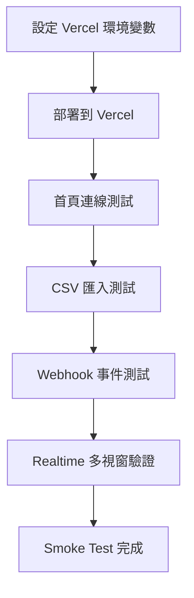

# Vercel 部署路線圖與驗證清單

## 1. 環境變數盤點

### Server Only
- `SUPABASE_URL`
- `SUPABASE_SERVICE_ROLE_KEY`

用途：
- [`api/rfid-webhook.js`](api/rfid-webhook.js)
- [`api/bulk-products.js`](api/bulk-products.js)

安全邊界：
- `SUPABASE_SERVICE_ROLE_KEY` 僅能放在 Vercel Project Environment Variables
- 不得暴露到前端 JS 或任何靜態檔案

### Client Side
- 前端目前由使用者在 UI 輸入 Supabase URL 與 Anon Key，儲存在 LocalStorage
- 如要改成正式部署預設值，建議後續改為由 Vercel 注入公開變數並在前端初始化

---

## 2. Vercel 專案設定

1. 連接 GitHub Repo
2. Framework Preset 使用 Other
3. Build Command 留空
4. Output Directory 留空
5. Root Directory 使用 repo 根目錄

原因：目前架構是
- 靜態頁面在 [`public/index.html`](public/index.html)
- Serverless Functions 在 [`api/rfid-webhook.js`](api/rfid-webhook.js) 與 [`api/bulk-products.js`](api/bulk-products.js)

---

## 3. 上線前檢查

### 必做
- Vercel 已設定 `SUPABASE_URL`
- Vercel 已設定 `SUPABASE_SERVICE_ROLE_KEY`
- Supabase `products` 表存在
- Supabase `rfid_events` 表存在
- `products` 至少有 `name` 與對應 EPC 欄位可供前端渲染
- `rfid_events` 至少有 `epc_data`, `reader_id`, `timestamp`

### 建議
- 為 `products` 的 upsert 衝突鍵建立唯一索引
- 為 `rfid_events.timestamp` 建立索引，避免查詢退化

---

## 4. 上線後 Smoke Test

1. 開啟首頁 [`public/index.html`](public/index.html)
2. 輸入 Supabase URL + Anon Key
3. 驗證連線狀態由初始化轉為正常
4. 點擊手動刷新，確認看板渲染成功
5. 上傳 CSV，確認 [`/api/bulk-products`](api/bulk-products.js) 回傳 success
6. 送出模擬 RFID 事件，確認 [`/api/rfid-webhook`](api/rfid-webhook.js) 回傳 success 或 debounced
7. 確認 `#eventLog` 有新增事件
8. 確認 `#dashboard` 狀態有刷新
9. 在第二個瀏覽器視窗觀察 Realtime 是否同步更新

---

## 5. 失敗時快速排查

### API 500
- 檢查 Vercel Runtime Logs
- 檢查環境變數是否缺漏
- 確認 Supabase 欄位名稱與程式一致

### Realtime 無更新
- 檢查瀏覽器 Console 是否有 `SUBSCRIBED`
- 確認 Supabase Realtime 對 `rfid_events` 已啟用

### 看板空白
- 檢查 `products` 是否有資料
- 檢查前端 Console 有無 DOM 綁定錯誤

---

## 6. 部署流程圖

