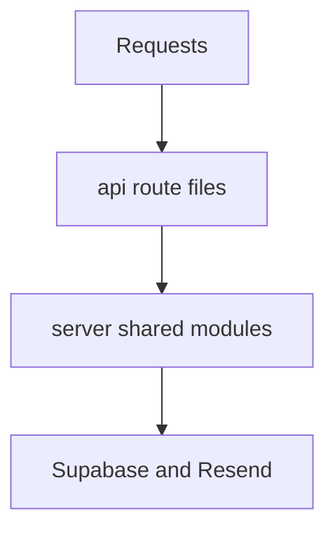
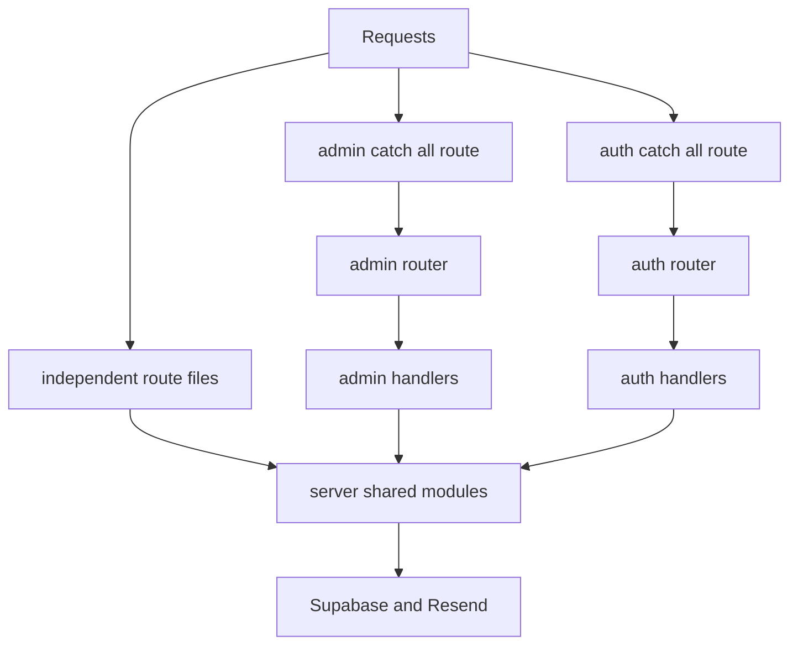

# Vercel Serverless Function 整併規劃

## 1. 問題來源

- 目前 [`api/`](api/) 目錄下共有 16 個 JavaScript 檔案
- Vercel Hobby 方案每次部署最多只能有 12 個 Serverless Functions
- 這 16 個檔案中，至少有 4 個其實是共用 helper，不應留在 [`api/`](api/) 目錄
- 即使先把 helper 移走，函式數量也只會剛好回到 12，後續再加新 API 就會再次超限

## 2. 目前盤點結果

### 2.1 目前會被計入函式數量的檔案

| 類型 | 檔案 | 對外路徑 | 方法 | 備註 |
| --- | --- | --- | --- | --- |
| helper | `api/_auth.js` | 無 | 無 | 不應算成獨立 function |
| helper | `api/_mailer.js` | 無 | 無 | 不應算成獨立 function |
| helper | `api/_supabase.js` | 無 | 無 | 不應算成獨立 function |
| helper | `api/sgtin96.js` | 無 | 無 | 不應算成獨立 function |
| route | `api/bulk-products.js` | `/api/bulk-products` | POST | 前端有呼叫 |
| route | `api/fitting-catalog.js` | `/api/fitting-catalog` | GET | 前端有呼叫 |
| route | `api/login.js` | `/api/login` | POST | 已標示 deprecated，未發現前端直接使用 |
| route | `api/rfid-webhook.js` | `/api/rfid-webhook` | POST | 前端有呼叫 |
| route | `api/trial-requests.js` | `/api/trial-requests` | POST | 前端有呼叫 |
| route | `api/admin/guest-users.js` | `/api/admin/guest-users` | POST | 管理頁使用 |
| route | `api/admin/trial-requests.js` | `/api/admin/trial-requests` | GET | 管理頁使用 |
| route | `api/admin/users/index.js` | `/api/admin/users` | GET POST | 管理頁使用 |
| route | `api/admin/users/[userId]/index.js` | `/api/admin/users/:userId` | PATCH DELETE | 管理頁使用 |
| route | `api/admin/users/[userId]/resend-invite.js` | `/api/admin/users/:userId/resend-invite` | POST | 管理頁使用 |
| route | `api/auth/forgot-password.js` | `/api/auth/forgot-password` | POST | 前端有呼叫 |
| route | `api/auth/me.js` | `/api/auth/me` | GET | 前端有呼叫 |

### 2.2 分類後的實際數量

| 分類 | 數量 | 說明 |
| --- | --- | --- |
| 目前 `api` 底下總檔數 | 16 | Vercel 可能全部掃描並納入部署 |
| 共用 helper | 4 | [`api/_auth.js`](api/_auth.js:1) [`api/_mailer.js`](api/_mailer.js:1) [`api/_supabase.js`](api/_supabase.js:1) [`api/sgtin96.js`](api/sgtin96.js:1) |
| 真正 API route | 12 | 移出 helper 後理論上可剛好壓回 Hobby 上限 |
| 可再縮減候選 | 1 到 6 | 取決於是否退役 [`api/login.js`](api/login.js:1) 與是否導入 catch all router |

### 2.3 前端直接依賴的 API 路徑

以下路徑已在前端程式碼中直接使用，整併時應盡量維持 URL 不變：

- `/api/trial-requests`
- `/api/fitting-catalog`
- `/api/rfid-webhook`
- `/api/bulk-products`
- `/api/auth/forgot-password`
- `/api/auth/me`
- `/api/admin/trial-requests`
- `/api/admin/users`
- `/api/admin/users/:userId`

### 2.4 可優先退役或再判斷的路徑

| 路徑 | 現況 | 建議 |
| --- | --- | --- |
| `/api/login` | 已在回應內容中標示 deprecated | 可列為第一個刪減候選 |
| `/api/admin/users/:userId/resend-invite` | 管理功能使用 | 若要保留 URL 可改由 catch all admin router 接手 |
| `/api/admin/guest-users` | 管理功能使用 | 可保留 URL，但由 admin router 統一處理 |

## 3. 方案總覽

本規劃保留兩條路徑：

- 階段 A：最小可行整併，先解除部署阻塞
- 階段 B：在階段 A 之上再收斂 admin 與 auth 類路由，替後續擴充保留空間

### 3.1 兩階段結果對比

| 比較項目 | 目前狀態 | 階段 A | 階段 B |
| --- | --- | --- | --- |
| `api` 目錄總檔數 | 16 | 12 | 約 6 |
| 對外 URL 變動 | 無 | 無 | 無 或極小 |
| 對前端 fetch 改動 | 無 | 無 | 原則上無 |
| 重構範圍 | 無 | 只搬移 helper 與修正 import | 搬移 helper 加建立集中 router |
| 部署成功機率 | 失敗 | 高 | 高 |
| 後續擴充空間 | 幾乎沒有 | 幾乎沒有 | 明顯增加 |
| 風險等級 | 高 | 低 | 中 |

## 4. 階段 A 最小可行整併

### 4.1 階段 A 目標

- 將非路由檔從 [`api/`](api/) 移出
- 保持所有對外 API 路徑不變
- 不改動前端 fetch URL
- 讓 Vercel 重新計算時只剩 12 個 route 檔

### 4.2 階段 A 建議目錄樹

```text
server/
  auth.js
  mailer.js
  supabase.js
  sgtin96.js

api/
  bulk-products.js
  fitting-catalog.js
  login.js
  rfid-webhook.js
  trial-requests.js
  admin/
    guest-users.js
    trial-requests.js
    users/
      index.js
      [userId]/
        index.js
        resend-invite.js
  auth/
    forgot-password.js
    me.js
```

### 4.3 階段 A 詳細目錄說明

| 目錄或檔案 | 角色 | 調整內容 |
| --- | --- | --- |
| `server/auth.js` | Bearer token 與 service token 權限邏輯 | 由 [`api/_auth.js`](api/_auth.js:1) 搬移 |
| `server/mailer.js` | Resend 寄信封裝 | 由 [`api/_mailer.js`](api/_mailer.js:1) 搬移 |
| `server/supabase.js` | Supabase admin client 與 body helper | 由 [`api/_supabase.js`](api/_supabase.js:1) 搬移 |
| `server/sgtin96.js` | EPC encode decode 工具 | 由 [`api/sgtin96.js`](api/sgtin96.js:1) 搬移 |
| `api/*.js` | 真正對外 serverless function | 保留原檔名與原 URL |

### 4.4 階段 A import 對照

| 原 import 來源 | 新 import 來源 | 受影響檔案範例 |
| --- | --- | --- |
| `./_auth.js` | `../server/auth.js` 或相對應層級 | [`api/bulk-products.js`](api/bulk-products.js:2) [`api/fitting-catalog.js`](api/fitting-catalog.js:2) [`api/rfid-webhook.js`](api/rfid-webhook.js:3) |
| `./_mailer.js` | `../server/mailer.js` 或相對應層級 | [`api/trial-requests.js`](api/trial-requests.js:2) |
| `./_supabase.js` | `../server/supabase.js` 或相對應層級 | 多數 admin 與 trial route |
| `./sgtin96.js` | `../server/sgtin96.js` 或相對應層級 | [`api/bulk-products.js`](api/bulk-products.js:3) [`api/rfid-webhook.js`](api/rfid-webhook.js:2) |

### 4.5 階段 A 路由對照表

| 外部路徑 | 現有 route 檔案 | 階段 A route 檔案 | 內部依賴調整 | 前端是否需改動 |
| --- | --- | --- | --- | --- |
| `/api/bulk-products` | `api/bulk-products.js` | `api/bulk-products.js` | 改 import 到 `server` | 否 |
| `/api/fitting-catalog` | `api/fitting-catalog.js` | `api/fitting-catalog.js` | 改 import 到 `server` | 否 |
| `/api/login` | `api/login.js` | `api/login.js` | 無或極少 | 否 |
| `/api/rfid-webhook` | `api/rfid-webhook.js` | `api/rfid-webhook.js` | 改 import 到 `server` | 否 |
| `/api/trial-requests` | `api/trial-requests.js` | `api/trial-requests.js` | 改 import 到 `server` | 否 |
| `/api/admin/guest-users` | `api/admin/guest-users.js` | `api/admin/guest-users.js` | 改 import 到 `server` | 否 |
| `/api/admin/trial-requests` | `api/admin/trial-requests.js` | `api/admin/trial-requests.js` | 改 import 到 `server` | 否 |
| `/api/admin/users` | `api/admin/users/index.js` | `api/admin/users/index.js` | 改 import 到 `server` | 否 |
| `/api/admin/users/:userId` | `api/admin/users/[userId]/index.js` | `api/admin/users/[userId]/index.js` | 改 import 到 `server` | 否 |
| `/api/admin/users/:userId/resend-invite` | `api/admin/users/[userId]/resend-invite.js` | `api/admin/users/[userId]/resend-invite.js` | 改 import 到 `server` | 否 |
| `/api/auth/forgot-password` | `api/auth/forgot-password.js` | `api/auth/forgot-password.js` | 視需要改共用 util | 否 |
| `/api/auth/me` | `api/auth/me.js` | `api/auth/me.js` | 改 import 到 `server` | 否 |

### 4.6 階段 A Function 數量試算

| 類別 | 數量 |
| --- | --- |
| 搬移前總檔數 | 16 |
| 移出的 helper | 4 |
| 搬移後 route 檔數 | 12 |
| 與 Hobby 上限差距 | 0 |

### 4.7 階段 A 優點

- 變動範圍最小
- 對外 URL 不變
- 前端與外部串接幾乎無感
- 最適合先恢復部署

### 4.8 階段 A 風險

- 只要再新增 1 個 API，就可能再次超限
- [`api/login.js`](api/login.js:1) 若實際仍被外部系統使用，短期內難直接刪除
- 部署雖可恢復，但架構壓力仍在

## 5. 階段 B 預留擴充空間的整併

### 5.1 階段 B 目標

- 在階段 A 已完成的前提下，繼續把 admin 與 auth 類 API 收斂為較少的 function
- 儘量保持對外 URL 不變
- 讓後續新增 admin 或 auth 子路徑時，不必再新增 serverless function 檔案

### 5.2 階段 B 建議目錄樹

```text
server/
  core/
    auth.js
    mailer.js
    supabase.js
  utils/
    sgtin96.js
  handlers/
    admin/
      guest-users.js
      trial-requests.js
      users-collection.js
      users-item.js
      users-resend-invite.js
    auth/
      forgot-password.js
      me.js
  routers/
    admin-router.js
    auth-router.js

api/
  bulk-products.js
  fitting-catalog.js
  rfid-webhook.js
  trial-requests.js
  admin/
    [...route].js
  auth/
    [...route].js
```

### 5.3 階段 B 詳細目錄說明

| 目錄或檔案 | 角色 | 說明 |
| --- | --- | --- |
| `server/handlers/admin/*.js` | 保留原業務邏輯單元 | 避免所有邏輯硬塞進單一 catch all 檔案 |
| `server/handlers/auth/*.js` | 保留 auth 子功能邏輯單元 | 將 `me` 與 `forgot-password` 分離 |
| `server/routers/admin-router.js` | 專責解析 `admin` 子路徑與 method | 對應 `guest-users` `trial-requests` `users` 等分支 |
| `server/routers/auth-router.js` | 專責解析 `auth` 子路徑與 method | 對應 `me` 與 `forgot-password` |
| `api/admin/[...route].js` | 唯一 admin serverless function 入口 | 接收 `/api/admin/*` 全部請求 |
| `api/auth/[...route].js` | 唯一 auth serverless function 入口 | 接收 `/api/auth/*` 全部請求 |

### 5.4 階段 B 路由對照表

| 外部路徑 | 現有 route 檔案 | 階段 B serverless 入口 | 階段 B handler | 前端是否需改動 |
| --- | --- | --- | --- | --- |
| `/api/bulk-products` | `api/bulk-products.js` | `api/bulk-products.js` | route 檔自行處理 | 否 |
| `/api/fitting-catalog` | `api/fitting-catalog.js` | `api/fitting-catalog.js` | route 檔自行處理 | 否 |
| `/api/rfid-webhook` | `api/rfid-webhook.js` | `api/rfid-webhook.js` | route 檔自行處理 | 否 |
| `/api/trial-requests` | `api/trial-requests.js` | `api/trial-requests.js` | route 檔自行處理 | 否 |
| `/api/auth/me` | `api/auth/me.js` | `api/auth/[...route].js` | `server/handlers/auth/me.js` | 否 |
| `/api/auth/forgot-password` | `api/auth/forgot-password.js` | `api/auth/[...route].js` | `server/handlers/auth/forgot-password.js` | 否 |
| `/api/admin/trial-requests` | `api/admin/trial-requests.js` | `api/admin/[...route].js` | `server/handlers/admin/trial-requests.js` | 否 |
| `/api/admin/guest-users` | `api/admin/guest-users.js` | `api/admin/[...route].js` | `server/handlers/admin/guest-users.js` | 否 |
| `/api/admin/users` | `api/admin/users/index.js` | `api/admin/[...route].js` | `server/handlers/admin/users-collection.js` | 否 |
| `/api/admin/users/:userId` | `api/admin/users/[userId]/index.js` | `api/admin/[...route].js` | `server/handlers/admin/users-item.js` | 否 |
| `/api/admin/users/:userId/resend-invite` | `api/admin/users/[userId]/resend-invite.js` | `api/admin/[...route].js` | `server/handlers/admin/users-resend-invite.js` | 否 |
| `/api/login` | `api/login.js` | 建議退役 | 無 | 原則上否 |

### 5.5 階段 B admin router 分派規則

| 解析後路徑片段 | HTTP 方法 | 導向 handler | 應回傳的錯誤類型 |
| --- | --- | --- | --- |
| `trial-requests` | GET | `trial-requests.js` | 其他方法回 405 |
| `guest-users` | POST | `guest-users.js` | 其他方法回 405 |
| `users` | GET | `users-collection.js` 的 list 行為 | 其他未定義方法回 405 |
| `users` | POST | `users-collection.js` 的 create 行為 | 同上 |
| `users/:userId` | PATCH | `users-item.js` 的 update 行為 | userId 缺失回 400 |
| `users/:userId` | DELETE | `users-item.js` 的 delete 行為 | 同上 |
| `users/:userId/resend-invite` | POST | `users-resend-invite.js` | 其他方法回 405 |
| 其他未知路徑 | 任意 | 不導向 | 回 404 |

### 5.6 階段 B auth router 分派規則

| 解析後路徑片段 | HTTP 方法 | 導向 handler | 應回傳的錯誤類型 |
| --- | --- | --- | --- |
| `me` | GET | `me.js` | 其他方法回 405 |
| `forgot-password` | POST | `forgot-password.js` | 其他方法回 405 |
| 其他未知路徑 | 任意 | 不導向 | 回 404 |

### 5.7 階段 B Function 數量試算

| 類別 | 數量 |
| --- | --- |
| 保留獨立 route | 4 |
| admin catch all | 1 |
| auth catch all | 1 |
| 合計 | 6 |
| 與 Hobby 上限差距 | 6 |

### 5.8 階段 B 優點

- 對外 URL 幾乎可完全維持
- 未來新增 admin 與 auth 子路徑時，不需再增加 function 數量
- 結構上更適合長期維護

### 5.9 階段 B 風險

- router 寫法若不嚴謹，404 405 權限錯誤可能互相覆蓋
- 單一入口檔出錯時，整包 admin 或 auth 功能都會受影響
- 需要比較清楚的測試矩陣來保證各條路由結果一致

## 6. 階段 A 與階段 B 的風險比較

| 比較面向 | 階段 A | 階段 B |
| --- | --- | --- |
| 調整範圍 | 小 | 中 |
| import 路徑錯誤風險 | 中 | 中 |
| 路由分派錯誤風險 | 低 | 高 |
| 回傳 404 405 一致性風險 | 低 | 中高 |
| 權限邏輯受影響範圍 | 中 | 中高 |
| 部署恢復速度 | 快 | 中 |
| 長期擴充性 | 低 | 高 |
| rollback 難度 | 低 | 中 |

### 6.1 建議理解方式

- 階段 A 是部署修復方案
- 階段 B 是結構治理方案
- 若當前優先順序是先把部署救回來，先做階段 A 最穩
- 若近期確定還要再加 admin 或 auth API，階段 B 會比較划算

## 7. 推薦採用的最終策略

若目標是低風險且前端改動最小，建議採用以下順序：

1. 先做階段 A，立即解除部署失敗
2. 同步評估是否直接刪除 `/api/login`
3. 若近期還會擴充 admin 或 auth 功能，再做階段 B

這樣可以避免一次重構過多，並保留觀察空間。

## 8. 建議實作順序

### 8.1 階段 A 實作順序

1. 建立 [`server/`](server/) 共用模組目錄
2. 將 `_auth` `_mailer` `_supabase` `sgtin96` 移出 [`api/`](api/)
3. 更新所有 route 檔案 import 路徑
4. 重新部署一次，確認已不超過上限
5. 確認 `/api/login` 是否仍需保留

### 8.2 階段 B 實作順序

1. 建立 `server/handlers/admin` 與 `server/handlers/auth`
2. 從原 route 檔抽出邏輯到 handlers
3. 建立 `server/routers/admin-router.js`
4. 建立 `server/routers/auth-router.js`
5. 建立 [`api/admin/[...route].js`](api/admin/) 與 [`api/auth/[...route].js`](api/auth/)
6. 移除舊的 admin 與 auth route 檔
7. 驗證現有 fetch 路徑不需改動

## 9. 建議驗證清單

### 9.1 共用驗證

- `POST /api/trial-requests`
- `GET /api/fitting-catalog`
- `POST /api/rfid-webhook`
- `POST /api/bulk-products`

### 9.2 auth 類驗證

- `GET /api/auth/me`
- `POST /api/auth/forgot-password`
- 未知 `auth` 子路徑應回 404
- 已知 `auth` 路徑但錯誤 method 應回 405

### 9.3 admin 類驗證

- `GET /api/admin/trial-requests`
- `POST /api/admin/guest-users`
- `GET POST /api/admin/users`
- `PATCH DELETE /api/admin/users/:userId`
- `POST /api/admin/users/:userId/resend-invite`
- 未知 `admin` 子路徑應回 404
- 已知 `admin` 路徑但錯誤 method 應回 405

## 10. 架構圖

### 10.1 階段 A



### 10.2 階段 B



## 11. 結論

- 只做 helper 移出即可先解除 Vercel 部署阻塞
- 但階段 A 只是把 function 數量壓回上限，不會留下新增空間
- 若要更安全地面對後續擴充，應再把 admin 與 auth 路由整併成 catch all router
- 在目前需求下，最佳策略仍是先做階段 A，再視是否需要 headroom 進入階段 B
