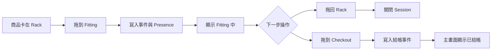

# Web Development Plan: RFID Fitting Room PoC

## 目標
以圖像化拖拉介面作為一級主流程，讓使用者直接在頁面拖動商品卡模擬進出試衣間與結帳，不依賴手工輸入 EPC 或 reader 數值。

## 產品方向
- 一級介面
  - 三欄看板 `RACK` `FITTING_ROOM` `CHECKOUT`
  - 商品卡拖放即觸發事件
  - 主畫面展示 KPI 與最近動作時間軸
- 二級介面
  - 保留既有設定 CSV 手動送事件作為備援與維運
  - 預設收合或次分頁，不干擾主流程

## 核心工作流程

## 資料與狀態原則
- 以資料庫狀態可還原為優先，刷新後畫面可重建
- 保留既有規則
  - 10 秒離場回 `RACK`
  - 15 分鐘異常停留仍屬 `FITTING_ROOM`
  - 30 秒分段為獨立試穿 session
- 拖放只是操作入口，不繞過後端事件與審計

## 實作分期

### Phase 1 介面分層
- [ ] 在 [`public/index.html`](public/index.html) 建立一級拖放看板骨架
- [ ] 在 [`public/index.html`](public/index.html) 將設定 CSV 手動事件移至二級備援面板
- [ ] 在 [`public/css/style.css`](public/css/style.css) 補齊看板欄位與卡片拖放樣式

### Phase 2 拖放交互與事件映射
- [ ] 在 [`public/js/main.js`](public/js/main.js) 實作拖放行為與欄位約束
- [ ] 在 [`public/js/main.js`](public/js/main.js) 定義映射
  - 拖到 `FITTING_ROOM` 送 fitting 事件
  - 拖回 `RACK` 送離場事件
  - 拖到 `CHECKOUT` 送結帳事件
- [ ] 新增結帳 API 或擴充 [`api/rfid-webhook.js`](api/rfid-webhook.js) 支援 UI 來源欄位

### Phase 3 狀態一致性
- [ ] 在 [`public/js/main.js`](public/js/main.js) 合併 presence session 與拖放暫態
- [ ] 確保重整後以 Supabase 資料重建當前欄位位置
- [ ] 保持與 [`api/rfid-webhook.js`](api/rfid-webhook.js) 的 timeout abnormal segmentation 一致

### Phase 4 視覺化輸出
- [ ] 主畫面 KPI
  - 在場總數
  - 試穿中
  - 異常停留
  - 已結帳
- [ ] 最近動作時間軸與單件商品最新位置
- [ ] 保留多語系文案整合於 [`public/js/main.js`](public/js/main.js)

### Phase 5 驗收與發佈
- [ ] 本地 smoke checklist
- [ ] 線上 smoke checklist
- [ ] 驗證主流程全程不需手工輸入數值
- [ ] 驗證二級備援面板可獨立除錯且不影響主操作

## 風險與對策
- EPC 與 style 映射不一致
  - 對策：第二階段導入 inventory item 優先匹配
- `products.sku` 欄位缺失造成查詢失敗
  - 對策：維持 fallback 並規劃 sku 單一來源
- Realtime 延遲造成拖放後視覺不同步
  - 對策：前端 optimistic 更新加上後端結果回寫修正
