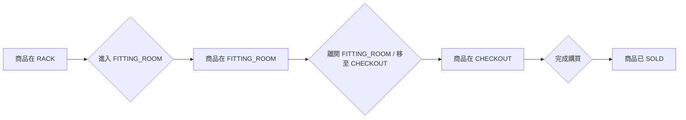

# Web Development Plan: RFID Fitting Room PoC

## 目標：
建立一個 RFID 試衣間概念驗證 (PoC) 的前端網頁應用程式，以視覺化 RFID 數據流並管理商品狀態。

## 核心工作流程狀態機：

## 待辦事項清單：
- [ ] 設定前端開發環境 (例如：React, Vite, Next.js)。
- [ ] 建立基本 HTML 結構與 CSS 樣式。
- [ ] 整合 Supabase 客戶端 SDK。
- [ ] 設計並實作 UI，用於顯示不同區域 (RACK, FITTING_ROOM, CHECKOUT, SOLD) 的商品，每個商品顯示其 EPC 資料和目前狀態。
- [ ] 使用 Supabase Realtime Subscriptions 訂閱商品狀態變化，並即時更新 UI。
- [ ] 開發功能以從 Supabase 讀取現有的 RFID 商品資料。
- [ ] 實作或整合功能來解析 SGTIN-96 Hex/Binary 格式的 EPC 資料，並顯示可讀的商品資訊。
    *   **批量導入產品資料功能 (CSV 格式)：**
        *   設計並實作網頁導入介面，允許使用者上傳 CSV 檔案。
        *   開發前端邏輯，解析上傳的 CSV 檔案內容。
        *   實作將解析後的產品資料 (包含 EPC 及其他相關資訊) 發送到後端 Supabase 的功能。
        *   考慮後端 Supabase 的 API 設計，以支援批量資料插入或更新。
- [ ] 建立一個簡易介面，允許手動輸入模擬的 RFID 讀取器數據 (`reader_id`, `epc_data`, `timestamp`)，以觸發狀態變化並觀察前端更新 (可選，用於測試)。
- [ ] 實作前端錯誤處理機制，以優雅地處理 API 請求失敗或即時訂閱錯誤。
- [ ] 將前端應用程式部署到 Vercel。
- [ ] 進行全面的功能測試，確保所有工作流程正常運作。