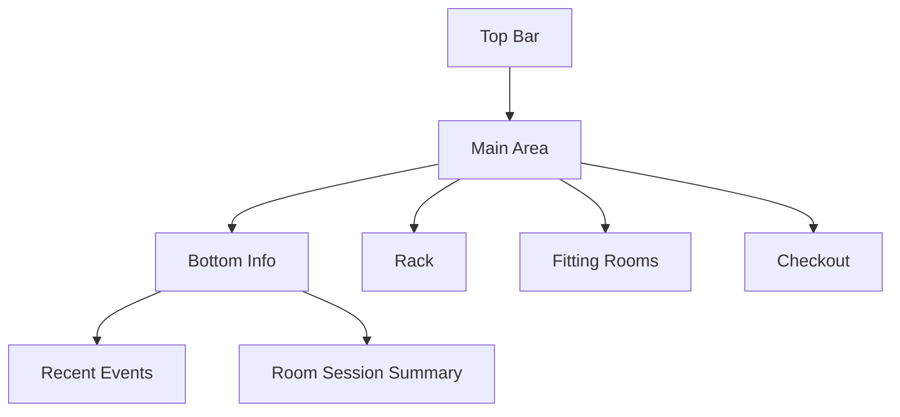
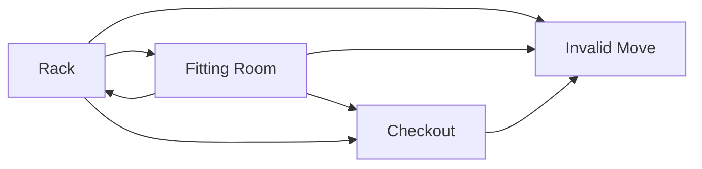

# Fitting Room UI 3.1 升級版規格

## 1 目標與範圍

本規格以 [`plans/fitting_demo_uiux_wireframe_plan_v3.md`](plans/fitting_demo_uiux_wireframe_plan_v3.md) 為基底，重寫可直接落地的升級版 UI 規格，並保留三欄主操作區與底部資訊區。

### 1.1 規劃目標

- 保留三欄布局：Rack、Fitting Rooms、Checkout
- 強化操作流程可解釋性：從展示到試穿到成交
- 將拖拉路徑、事件名稱、UI 回饋整合為單一規格
- 對齊資料規格命名，事件名稱採用資料層版本
- 讓 Code 模式可直接依本文件拆解與實作

### 1.2 本版納入

- Top Bar 與頁面資訊架構
- 三欄區塊與元件責任
- 拖拉合法路徑矩陣
- 事件映射與狀態流
- Toast 與錯誤回滾規則
- 驗收清單與 Code 模式任務分解

### 1.3 本版不納入

- 多門市切換
- Room to Room 直接搬移
- 多件批次拖拉
- 進階地圖式樓層視覺

---

## 2 頁面定位

本頁是流程展示與操作頁，不是資料維護頁。

設計原則：

- 重互動
- 重流程理解
- 輕表單感
- 企業感與可 Demo 性並存

---

## 3 資訊架構

## 3.1 Top Bar

左側：

- 標題 Fitting Room Demo
- 副標說明流程用途

右側：

- Reset Demo
- Seed Demo Data
- Active Alerts Badge
- Mode Status Badge
- 導航連結

## 3.2 Main Area 三欄

- 左欄 Rack 28%
  - 商品卡列表
  - 選品後在右欄選 size
- 中欄 Fitting Rooms 44%
  - 4 間固定 Room 以 2 x 2 顯示
  - Room 內顯示在室商品與 dwell
- 右欄 Checkout 28%
  - Checkout drop zone
  - 已成交項目與 sale type

## 3.3 Bottom Information Area

- Recent Events Table
- Room Session Summary

---

## 4 主要使用流程

1. 使用者於 Rack 點選商品
2. 於 Selected Item Detail 選擇 size
3. 拖曳 Selected Variant Card 到合法區塊
4. 系統先做路徑驗證
5. 成功才建立事件與更新畫面
6. 失敗則回滾並顯示錯誤訊息

---

## 5 元件與責任邊界

### 5.1 頁面層

- FittingRoomDemoPage
  - 全域狀態
  - render 協調
  - drag drop 事件分派

### 5.2 區塊層

- DemoTopBar
- RackPanel
- FittingRoomsGrid
- CheckoutPanel
- BottomInfoArea

### 5.3 卡片與列表層

- RackItemCard
- SelectedVariantCard
- RoomCard
- CheckoutRecordItem
- RecentEventsTable
- RoomSessionSummaryTable
- ToastStack

### 5.4 邏輯層

- dragRules
  - isValidMove
  - resolveEventPlan
- stateMapper
  - UI model mapping
- demoApi
  - postRfidEvent
  - fetchRecentEvents

---

## 6 UI 資料模型

```txt
Item
- id
- product_name
- color
- size
- sku_ean13
- item_status on_display in_fitting_room moved_to_checkout sold
- fitting_room_id nullable

Room
- id
- name
- occupancy
- items
- has_overdue

Session
- id
- fitting_room_id
- session_status active completed abandoned
- started_at
- ended_at
- dwell_seconds

Event
- id
- timestamp
- event_type
- item_id
- fitting_room_id
- session_id
- metadata

Sale
- id
- item_id
- sale_type try_on_purchase direct_purchase
- sold_at
```

---

## 7 拖拉合法路徑與事件映射

事件命名採資料規格版本。

| from | to | 合法 | 事件 | Session 行為 | Item 狀態 | Sale Type |
|---|---|---|---|---|---|---|
| Rack | Room | 是 | item_entered_fitting_room + item_added_to_session | 建立或加入 active session | in_fitting_room | 無 |
| Room | Rack | 是 | item_left_fitting_room + item_returned_to_floor | 保留 session 後續可完成 | returned_to_floor | 無 |
| Room | Checkout | 是 | item_left_fitting_room + item_moved_to_checkout | 將 session 標記 completed | moved_to_checkout 再 sold | try_on_purchase |
| Rack | Checkout | 是 | item_moved_to_checkout | 不建立 fitting session | moved_to_checkout 再 sold | direct_purchase |
| 其他 | 任意 | 否 | 無 | 無 | 不變 | 無 |

### 7.1 drop 驗證順序

1. 驗證 drag source 是否可拖曳
2. 驗證 drop target 是否可接收
3. 驗證 from to 是否在合法矩陣
4. 組裝事件計畫
5. 呼叫 API
6. 成功後提交狀態
7. 失敗回滾

### 7.2 回滾規則

- 任一步驟失敗，UI 必須回復 drop 前狀態
- 不得出現庫存先扣再失敗的殘留
- 失敗時 Recent Events 不新增假事件

---

## 8 互動狀態與視覺回饋

### 8.1 拖曳生命週期

1. dragstart
   - 卡片加 dragging 樣式
   - 合法 drop zone 高亮
2. dragover enter
   - 目前目標區顯示 hover 樣式
3. drop
   - 執行路徑驗證與事件提交
4. success
   - 更新三欄與底部資訊
   - success toast
5. error
   - 還原畫面
   - error toast

### 8.2 Toast 文案

成功：

- Item entered fitting room
- Item returned to rack
- Purchase completed
- Direct purchase completed
- Demo reset successfully

錯誤：

- Invalid move
- This item cannot be dropped here
- Failed to update item state
- Action could not be completed

### 8.3 警示規則

- 超過 dwell 門檻時 Room 顯示 overdue 樣式
- Top Bar Active Alerts 顯示計數

---

## 9 區塊細部規格

## 9.1 Rack

- 顯示 item color 群組卡
- 卡片欄位：image、name、color、item no、style no、available
- low stock 顯示 warning pill
- 空狀態顯示 No items available on rack

## 9.2 Selected Item Detail

- 顯示目前選中商品
- 顯示 size selector 與各 size 庫存
- 產生可拖曳 Selected Variant Card

## 9.3 Fitting Rooms

- 固定 4 rooms
- 每 room 顯示 occupancy
- 顯示房內 item dwell
- overdue item 顯示 danger pill

## 9.4 Checkout

- 接受 Rack 與 Room 來源
- 顯示成交項目
- 顯示 sale type badge

## 9.5 Bottom Area

- Recent Events
  - time
  - item
  - room
  - event_type
  - status
- Room Session Summary
  - room
  - item count
  - active items
  - time in room

---

## 10 視覺與響應式原則

- 風格：enterprise SaaS clean structured
- 卡片：淺邊框、白底、輕陰影
- 主要色：藍系，警示橘色，危險紅色
- 桌機優先
- 小螢幕退化為單欄堆疊

---

## 11 Mermaid 線框





---

## 12 驗收清單

1. 頁面包含 Top Bar 三欄 Bottom 區塊
2. Rack 可選商品且能選 size
3. Selected Variant 可拖曳
4. Room 可接收 Rack 來源
5. Checkout 可接收 Rack 與 Room 來源
6. 非法路徑會回彈並顯示錯誤
7. 合法路徑會建立正確事件
8. 事件名稱使用資料規格命名
9. Recent Events 反映實際操作
10. Room Summary 可見 occupancy 與 dwell
11. Alerts 計數會隨 overdue 變化
12. 響應式在窄螢幕可退化顯示

---

## 13 Code 模式執行清單

1. 更新 [`public/fitting-demo.html`](public/fitting-demo.html) 補上 Checkout panel 容器與語意標籤
2. 更新 [`public/js/fitting-demo.js`](public/js/fitting-demo.js) 新增 Checkout state 與 render
3. 實作 `dragRules.isValidMove` 與 `dragRules.resolveEventPlan`
4. 將 drop handler 改為統一走事件計畫與回滾流程
5. 對接資料規格事件名稱，保留 UI 字串獨立映射
6. 擴充 Recent Events 欄位與資料來源
7. 擴充 Room Session Summary 顯示 session status
8. 更新 [`public/css/style.css`](public/css/style.css) 完整三欄與 drop 狀態樣式
9. 完成成功與失敗 toast 文案對應
10. 依驗收清單逐項手測並記錄結果

---

## 14 與現況差異摘要

相較目前實作，本版新增或強化：

- Checkout 欄位與路徑規則完整化
- 4 條合法路徑全覆蓋
- 事件命名改為資料規格命名
- Session 與 Sale type 視圖整合
- 失敗回滾規則明文化
